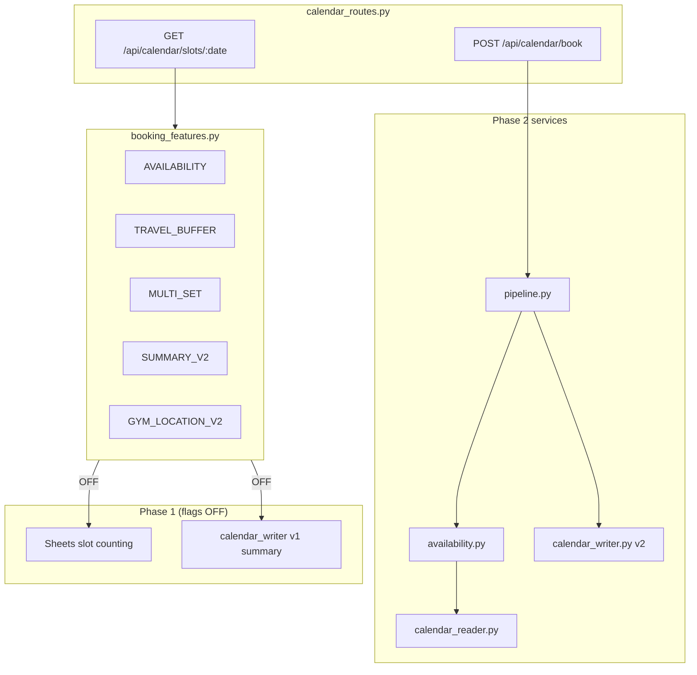

# BOOKING_PHASE2_IMPLEMENTATION_PLAN_v1

**Версия:** 1.1 (capacity rules amendment)  
**Дата:** 2026-06-01  
**Ветка:** `feature/booking-phase2`  
**Статус contract review:** ✅ завершён (TGbotAdmin sign-off)  
**Production gate:** staging smoke green → rollout по flags (только `mywave-site`)

---

## 0. Резюме

Phase 2 добавляет Calendar-based availability, multi-set Катер (1 continuous event), summary v2, travel buffer 120 min — **за feature flags**, без регрессии Phase 1.

| PR | Scope | Оценка |
|----|-------|--------|
| **PR1** | Contracts + feature flags | **0.5–1 день** |
| **PR2** | Availability engine (boat exclusive + gym capacity) | **2.5–3.5 дня** |
| **PR3** | Calendar writer v2 + pipeline | **1.5–2 дня** |
| **PR4** | Frontend multi-set UX | **1.5–2 дня** |
| **PR5** | Tests + staging smoke | **1–2 дня** |
| **Итого (dev)** | | **7–11 дней** |
| Staging smoke + TGbotAdmin joint | | **+0.5–1 день** |
| Prod rollout (по flags, поэтапно) | | **+0.5 дня** (не параллельно с кодом) |

**Календарная оценка:** ~2 календарные недели (solo dev, с review и staging).

---

## 1. Принятые контракты (sign-off TGbotAdmin)

| Требование | Статус |
|------------|--------|
| Multi-set Катер = 1 continuous Calendar event | ✅ |
| Summary v2 (`Тренировка — Зал/Катер — …`) | ✅ |
| Travel buffer 120 min (gym↔boat) | ✅ |
| WEB_ID marker | ✅ |
| Availability через Google Calendar | ✅ |
| Boat capacity (exclusive, 1 client) | ✅ |
| Gym capacity (group, max 4) | ✅ |
| Location values (boat URL, gym `Зал`) | ✅ |
| Confirmation context (coords, map) | ✅ |
| Telegram `(ID: tg_id)` без изменений | ✅ |

**Документы (входят в PR1):**

- [`BOOKING_CALENDAR_EVENT_CONTRACT_v2.md`](BOOKING_CALENDAR_EVENT_CONTRACT_v2.md)
- [`BOOKING_AVAILABILITY_CONTRACT_v1.md`](BOOKING_AVAILABILITY_CONTRACT_v1.md)
- [`BOOKING_PHASE2_STAGING_SMOKE.md`](BOOKING_PHASE2_STAGING_SMOKE.md)
- Amendment [`TGBOT_SITE_BOOKING_SYNC_PLAN.md`](TGBOT_SITE_BOOKING_SYNC_PLAN.md) §12

---

## 2. Архитектура Phase 2 (target)



**Порядок в pipeline (Phase 2):**

```text
normalize → build interval → idempotency → availability recheck → client_resolver → Calendar insert → Sheets
```

---

## 3. PR-серия

### PR1 — Contracts + feature flags

**Цель:** зафиксировать sign-off в docs; добавить конфиг flags (default OFF); Phase 1 regression без изменений поведения.

**Файлы:**

| Файл | Действие |
|------|----------|
| `docs/integration/BOOKING_CALENDAR_EVENT_CONTRACT_v2.md` | status → approved |
| `docs/integration/BOOKING_AVAILABILITY_CONTRACT_v1.md` | status → approved |
| `docs/integration/BOOKING_PHASE2_STAGING_SMOKE.md` | status → approved |
| `docs/integration/TGBOT_SITE_BOOKING_SYNC_PLAN.md` | §12 contract review ✅ |
| `docs/integration/BOOKING_PHASE2_IMPLEMENTATION_PLAN_v1.md` | этот документ |
| `app/config/booking_features.py` | **new** — чтение env flags |
| `app/config/__init__.py` или `app/__init__.py` | expose flags в config (optional) |
| `tests/unit/test_booking_features.py` | **new** — default OFF, truthy parsing |

**Feature flags (default OFF):**

```python
BOOKING_PHASE2_AVAILABILITY=0
BOOKING_PHASE2_TRAVEL_BUFFER=0
BOOKING_PHASE2_MULTI_SET_BOAT=0
BOOKING_PHASE2_SUMMARY_V2=0
BOOKING_PHASE2_GYM_LOCATION_V2=0
```

**DoD PR1:**

- [ ] Все Phase 2 docs в PR, статус approved
- [ ] `booking_features.py` + unit tests
- [ ] `test_booking_phase1.py` — 14 passed (без изменений поведения)
- [ ] CI green
- [ ] Production deploy **не обязателен** (flags OFF = no-op)

**Оценка:** 0.5–1 день (docs mostly done; flags + tests).

**Rollback:** revert PR1; flags absent = OFF.

---

### PR2 — Availability engine

**Зависимость:** PR1 merged (flags exist).

**Цель:** Calendar availability с **раздельной моделью** boat (exclusive) / gym (capacity ≤4) + travel buffer + multi-set.

**Файлы:**

| Файл | Действие |
|------|----------|
| `app/services/booking/calendar_reader.py` | **new** — list events for day, parse intervals |
| `app/services/booking/availability.py` | **new** — boat overlap, gym occupancy, buffer, max_set_count |
| `app/config/booking_durations.py` | `TRAINER_TRAVEL_BUFFER_MINUTES`, capacity constants |
| `app/config/booking_venues.py` | **new** (optional) — gym coords/map constants |
| `app/routes/calendar_routes.py` | wire `get_boat_slots`, `_get_available_slots_internal` behind flag |
| `tests/unit/test_booking_availability_phase2.py` | **new** |

**Ключевая логика (`availability.py`):**

| Service | Model | Rule |
|---------|-------|------|
| **Boat** | Exclusive interval | `overlap(candidate, existing_boat)` → blocked |
| **Gym** | Group capacity | `occupancy = count(gym events overlapping [T,T+90))`; available if `< 4` |
| **Both** | Travel buffer | symmetric 120 min when `BOOKING_PHASE2_TRAVEL_BUFFER=1` |
| **Boat** | Multi-set | `max_set_count` — max N adjacent free segments |

- Service type: `extendedProperties.service_type` → summary parse → duration heuristic
- Flag OFF → delegate to existing Sheets logic (Phase 1)

**DoD PR2:**

- [ ] Unit tests: boat exclusive overlap, gym 3/4→4/4, multi-set block 18:00–19:00, buffer §6.2
- [ ] GET gym slots: `remaining`, `max_capacity: 4` from Calendar
- [ ] GET boat slots: exclusive; optional `max_set_count`
- [ ] Flag OFF → identical Phase 1 slot lists (regression `test_boat_slots.py`)
- [ ] Structured logs: `availability_blocked_overlap`, `availability_blocked_capacity`
- [ ] No PII in logs

**Оценка:** 2.5–3.5 дня (dual model + Calendar API mocking).

**Rollback:** `BOOKING_PHASE2_AVAILABILITY=0`.

---

### PR3 — Calendar writer v2 + pipeline

**Зависимость:** PR2 merged (availability callable from pipeline).

**Цель:** multi-set continuous event, summary v2, gym location v2, pre-confirm recheck, extended idempotency.

**Файлы:**

| Файл | Действие |
|------|----------|
| `app/services/booking/calendar_writer.py` | summary v2, set_count, duration N×30, location v2 |
| `app/services/booking/pipeline.py` | `set_count` param, availability recheck, 409 on conflict |
| `app/services/booking/idempotency.py` | phone + date + start/end + service_type |
| `app/services/booking/sheets_writer.py` | duration = N×30 for boat |
| `app/routes/calendar_routes.py` | accept `set_count`, pass to pipeline |
| `app/schemas.py` | optional `set_count` in BookingSchema |
| `tests/unit/test_booking_calendar_v2.py` | **new** |

**Изменения `calendar_writer.py`:**

- `build_event_summary_v2()` — склонение сет/сета/сетов
- `build_calendar_event_body(..., set_count=1)` — end = start + duration
- `extendedProperties`: `set_count`, `duration_min`
- Flags: `BOOKING_PHASE2_SUMMARY_V2`, `BOOKING_PHASE2_GYM_LOCATION_V2`

**Изменения `pipeline.py`:**

```python
execute_web_booking(..., set_count: int = 1)
# before insert:
if is_phase2_availability_enabled():
    assert_slot_available(...)  # raises SlotUnavailableError → 409
```

**DoD PR3:**

- [ ] Boat N=3 → 1 event, 90 min, summary v2, set_count in extendedProperties
- [ ] Gym → 90 min, summary v2, location `Зал` (flag ON)
- [ ] Flags OFF → Phase 1 summary/location/duration unchanged
- [ ] Pre-confirm recheck blocks race duplicate
- [ ] `test_booking_phase1.py` green with flags OFF
- [ ] Path B (`sheets.book_slot`) unchanged API unless set_count passed

**Оценка:** 1.5–2 дня.

**Rollback:** flags OFF; existing events valid.

---

### PR4 — Frontend multi-set UX

**Зависимость:** PR3 merged (API accepts `set_count`, slots return `max_set_count`).

**Цель:** UI выбора N смежных сетов катера; confirmation context для gym; preview duration.

**Файлы:**

| Файл | Действие |
|------|----------|
| `static/js/booking.js` | set_count selector, preview, POST payload |
| `templates/partials/booking_modals.html` | multi-set UI, gym map/coords in success |
| `static/css/style.css` | minimal styles for set picker (if needed) |

**UX (boat, flag ON via staging):**

- После выбора времени — selector: 1…`max_set_count` сетов
- Preview: `15:00–16:30 (3 сета)`
- POST: `{ service_type: "boat", set_count: 3, ... }`
- Non-adjacent impossible by UI (only contiguous from start slot)

**UX (gym confirmation):**

- Success modal: coords `55.777052, 37.502594`, link `https://yandex.ru/maps/-/CLWQy6-I`

**Graceful degradation:**

- Если API без `max_set_count` (flags OFF) — UI как Phase 1 (single set)

**DoD PR4:**

- [ ] Manual QA on staging with all flags ON
- [ ] No JS errors when flags OFF (Phase 1 UX)
- [ ] CSRF + existing booking flow intact

**Оценка:** 1.5–2 дня.

**Rollback:** frontend backward-compatible; flags OFF = old UX.

---

### PR5 — Tests + staging smoke

**Зависимость:** PR1–PR4 merged to `feature/booking-phase2`.

**Цель:** полное покрытие Phase 2; staging deploy; joint smoke checklist.

**Файлы:**

| Файл | Действие |
|------|----------|
| `tests/unit/test_booking_availability_phase2.py` | дополнить edge cases |
| `tests/unit/test_booking_calendar_v2.py` | summary v2, multi-set body |
| `tests/unit/test_booking_phase1.py` | regression suite (flags OFF fixture) |
| `tests/unit/test_boat_slots.py` | flag OFF + ON branches |
| `docs/integration/BOOKING_PHASE2_STAGING_SMOKE.md` | fill results table (post-smoke) |

**Staging deploy:**

```bash
# staging .env
BOOKING_PHASE2_AVAILABILITY=1
BOOKING_PHASE2_TRAVEL_BUFFER=1
BOOKING_PHASE2_MULTI_SET_BOAT=1
BOOKING_PHASE2_SUMMARY_V2=1
BOOKING_PHASE2_GYM_LOCATION_V2=1
sudo systemctl restart mywave-site
```

**DoD PR5:**

- [ ] All unit tests pass locally + CI
- [ ] Staging smoke checklist §1–§9 green
- [ ] TGbotAdmin cross-smoke §8 green
- [ ] Owner sign-off for prod rollout plan
- [ ] **Production still flags OFF**

**Оценка:** 1–2 дня (tests 0.5–1d, staging smoke 0.5–1d).

---

## 4. Production rollout (после PR5, отдельный scope)

**Не часть PR5 merge.** Выполняется Owner после staging green.

| Step | Flag ON | Verify |
|------|---------|--------|
| 1 | `BOOKING_PHASE2_AVAILABILITY` | slots API, gym/boat book |
| 2 | `BOOKING_PHASE2_TRAVEL_BUFFER` | buffer scenarios |
| 3 | `BOOKING_PHASE2_MULTI_SET_BOAT` | 3-set booking |
| 4 | `BOOKING_PHASE2_SUMMARY_V2` + `GYM_LOCATION_V2` | Calendar summary/location |

Each step: restart **only** `mywave-site`, API smoke, 24h watch.

**Rollback:** all flags → `0`, restart `mywave-site`.

---

## 5. Матрица зависимостей PR

```text
PR1 (flags)
  └─► PR2 (availability) ──► PR3 (writer+pipeline) ──► PR4 (frontend)
        └──────────────────────────────────────────────────► PR5 (tests+smoke)
```

PR2 и PR3 можно частично параллелить **только** если availability interface зафиксирован в PR1 review — рекомендуется **sequential** для solo dev.

---

## 6. Риски

| Риск | Митигация |
|------|-----------|
| Calendar API latency on slots | cache day events per request; timeout + fallback log |
| Phase 1 regression | flags OFF default; dedicated regression tests each PR |
| Race double-book | pre-confirm recheck in PR3 |
| Sheets vs Calendar drift | Phase 2 SoT = Calendar; Sheets write after insert only |
| Unrelated local changes in branch | PR1 scope only booking docs + flags; не смешивать P0/UI WIP |

---

## 7. Что не входит в Phase 2

- TGbotAdmin bot-side code changes
- Merge web→bot by phone
- `mywave-node` / `mywave-telegram-bot` restart
- Изменение Sheets headers / SPREADSHEET_ID
- Production deploy до staging smoke

---

## 8. Критерий готовности Phase 2

1. ✅ Contract review (done)
2. PR1–PR5 merged to `feature/booking-phase2`
3. Staging smoke green + TGbotAdmin joint
4. Owner-approved prod flag rollout
5. Phase 1 tests green with all flags OFF on prod

---

## 9. Следующий шаг (немедленно)

**PR1:** обновить статусы docs → approved, добавить `app/config/booking_features.py` + tests, открыть PR `feature/booking-phase2` → `main`.
