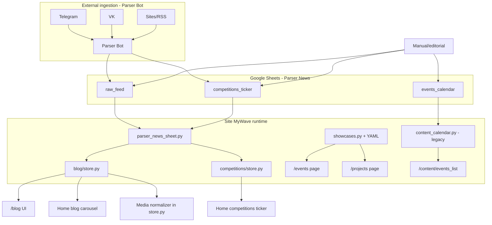

# EVENTS-0 — Events / Competitions Parser & Display Audit

**Track:** TRACK A — Events / Competitions (independent from Phase 2 booking, independent from Social Mission)  
**Status:** EVENTS-0 read-only audit  
**Date:** 2026-06-12  
**Production mode:** **OBSERVE** — no parser/env/cron/UI changes without GM approval

**Related closeout:** `docs/integration/BOOKING_PHASE2_PRODUCTION_RELEASE_CLOSEOUT.md`

---

## Executive summary

Сейчас «события» и «соревнования» на Site MyWave **не проходят через единый pipeline**. Данные живут в **четырёх параллельных контурах**:

1. **Parser News → `competitions_ticker`** — бегущая строка соревнований на главной (работает по контракту v1).
2. **Parser News → `raw_feed`** — блог/новости (Parser Bot); события **могут попасть сюда как обычные посты** без `content_type`.
3. **Static YAML showcases** — `/events`, `/projects`, JSON-LD; camps/workshops/challenges вручную в репозитории.
4. **Legacy `events_calendar` sheet** — отдельный лист + blueprint `content_calendar` (hardcoded имя таблицы); **не подключён к главной**.

**Вывод:** чинить парсер «вслепую» нельзя — сначала нужна унификация read-model и классификатор `content_type` (PR Events-1), затем API/review (Events-2), UI (Events-3), parser hardening (Events-4).

---

## 1. Текущие источники данных

| Источник | Где парсится | Куда пишется | Что читает Site | Статус |
|----------|--------------|--------------|-----------------|--------|
| **Telegram** | **Parser Bot** (внешний репозиторий) | `raw_feed` (`source_type`, `source_url`) | `app/services/blog/store.py` | Active path для новостей |
| **VK** | **Parser Bot** (предполагается по `source_type`) | `raw_feed` | Blog store | Нет отдельного Site-парсера; только через Sheets |
| **Сайты / RSS / external** | **Parser Bot** | `raw_feed` | Blog store | Same |
| **Google Sheets — `raw_feed`** | Parser Bot + editorial | Parser News spreadsheet | Blog `/blog`, home preview | Primary blog SoT |
| **Google Sheets — `competitions_ticker`** | Parser News / manual | Parser News spreadsheet | Home ticker, `GET /api/competitions/ticker` | **Implemented** (Contract v1) |
| **Google Sheets — `events_calendar`** | Manual / legacy import | Лист в `MyWave_Parser_News` (hardcoded в коде) | `/content/events_list` only | **Legacy**, fragile |
| **Static YAML** | Manual (Git) | `configs/showcases/*.yaml` | `/events`, `/projects`, JSON-LD | Active for MyWave-owned events/camps |
| **Static JSON/MD (projects)** | Manual | `static/data/projects/wsc2025/` etc. | `/projects/wakesurf-challenge-2025` | One-off competition landing |
| **Google Calendar** | Booking/TGbotAdmin | Calendar API | Booking slots only | **Not** events vitrine |
| **Admin/Tg Bot spreadsheet** | Manual forms, booking | `SPREADSHEET_ID` | Booking/clients | **Must not** mix with Parser News |

### Site does NOT parse Telegram/VK directly

Site — **consumer** таблиц Parser News. Ingestion ownership: **Parser Bot / Parser News team**.

Документы контракта:

- Blog: `docs/BLOG_CONTRACT_v1.md`, `docs/architecture/BLOG_CANONICAL_MAPPING.md`
- Competitions ticker: `docs/COMPETITIONS_TICKER_CONTRACT_v1.md`
- Media: `docs/integrations/PARSER_DEVELOPER_MEDIA_LETTER.md`

---

## 2. Текущий pipeline (as-is)

### Stage-by-stage

| Stage | Module | Input | Output |
|-------|--------|-------|--------|
| **Source resolution** | `app/services/parser_news_sheet.py` | `PARSER_NEWS_SPREADSHEET_ID`, `PARSER_TAB`, `PARSER_SHEET_NAME` | `(spreadsheet_id, worksheet)` |
| **Competitions source** | `app/services/competitions/sheet.py` | Same spreadsheet + `COMPETITIONS_SHEET_NAME` | `competitions_ticker` rows |
| **Parser (external)** | Parser Bot repo | Channels, sites | Rows in Sheets |
| **raw_feed read** | `fetch_parser_news_rows()` | Sheet rows | `List[Dict]` |
| **Publishability filter** | `app/services/blog/publishability.py` | Row dict | bool (news only) |
| **Media normalizer** | `app/services/blog/store.py` | `cover_image_url`, `raw_media`, `media_json` | `cover_image_url`, embed HTML |
| **Blog API** | `app/routes/blog.py` | Normalized posts | `/api/blog/posts`, `/api/blog/latest` |
| **Blog UI** | `templates/blog/*` | Post read-model | `/blog`, `/blog/<slug>` |
| **Competitions API** | `app/routes/competitions.py` | Ticker items | `/api/competitions/ticker` |
| **Competitions UI** | `templates/partials/home_competitions_ticker.html` | Marquee items | Home `#competitions-ticker` only |
| **Events UI (static)** | `app/__init__.py` → `events_page()` | YAML `channels: [events]` | `/events` |
| **Projects/camps UI** | `showcases.get_project_cards()` | YAML `channels: [projects]` | `/projects`, camp landings |
| **Legacy calendar** | `app/routes/content_calendar.py` | `events_calendar` worksheet | `/content/events_list`, `/content/events` JSON |

### Env variables (Site read side)

| Variable | Purpose |
|----------|---------|
| `PARSER_NEWS_SPREADSHEET_ID` | Parser News table (blog + competitions) |
| `PARSER_SHEET_NAME` | Default `raw_feed` |
| `COMPETITIONS_SHEET_NAME` | Default `competitions_ticker` |
| `COMPETITIONS_SHEETS_CACHE_TTL` | Ticker cache (default 300s) |
| `BLOG_SHEETS_CACHE_TTL` | Blog cache (default 120s) |

---

## 3. Где теряются или смешиваются типы контента

| Content type | Intended home | Actual home today | Loss / mix risk |
|--------------|---------------|-------------------|-----------------|
| **Соревнования (world tour)** | `competitions_ticker` + future `/events` | Ticker OK; full card page **missing** | Parser may also write announcement → `raw_feed` as **news** |
| **Мероприятия MyWave** | `/events` or `/projects` | YAML showcases (`sochi_camp` → `/events`) | Not synced with Parser; manual Git deploy |
| **Camps** | `/projects/mywave-ruza-camp`, services modal | YAML + lead forms | Booking camp modal ≠ events registry |
| **Workshops** | TBD | Often **news post** in `raw_feed` | No `content_type`; indistinguishable from article |
| **Новости** | `/blog` | `raw_feed` + publishability v1 | Correct path |
| **Обычные посты** | `/blog` | Same | OK |
| **Telegram ingest rows** | Depends on editorial | `raw_feed` with `ingest_status` | `ingest_status=posted` used wrongly in `content_calendar/events` JSON |
| **Home «Мероприятия» block** | Calendar/table | `index.html` `#events` | **`months` hardcoded empty** in `home()` — block never populated from Sheets |

### Critical gaps

1. **No `content_type` column** in blog read-model or competitions contract — classification is **implicit** (which sheet row landed on).
2. **Three event UIs** (`/events` YAML, ticker, legacy `events_list`) — no shared slug or dedup.
3. **`content_calendar.py`** opens `'MyWave_Parser_News'` by **display name**, not `PARSER_NEWS_SPREADSHEET_ID` — breaks if spreadsheet renamed or env differs.
4. **Home events section** (`app/__init__.py` line ~138): `months = {'Июнь': [], ...}` — **never calls** `get_events_by_month()`.
5. **Competition news vs competition event**: e.g. «результаты чемпионата» → blog; «даты этапа IWWF» → should be `competition` but may land in `raw_feed`.
6. **Media**: Telegram page URLs in `cover_image_url` → broken cards (documented in media letter).

---

## 4. Поля в текущих данных

### 4.1 `raw_feed` (blog / news) — canonical columns per site-publisher rules

Present in contract / code (not all populated on prod):

| Field | In raw_feed | Used by Site | Notes |
|-------|-------------|--------------|-------|
| `title` / `raw_title` | ✔ | ✔ | Display title |
| `date` / `published_at` / `created_at` | ✔ | ✔ | Publication timing |
| `location` | ⚠️ rare | ❌ | Not in blog read-model |
| `organizer` | ❌ | ❌ | — |
| `source_url` | ✔ | ✔ | |
| `source_type` | ✔ | ✔ | telegram/vk/site hint |
| `source_name` | ✔ | ✔ | |
| `media` / `raw_media` / `media_json` | ✔ | ✔ | Normalizer in store |
| `tags` / `raw_tags` | ✔ | ✔ | |
| `status` | ✔ | ✔ | READY_TO_PUBLISH / PUBLISHED |
| `published` flag | via status | ✔ | No separate boolean |
| `content_type` | ❌ | ❌ | **Missing** |
| `slug` | ✔ | ✔ | |
| `summary` / `excerpt` | ✔ | ✔ | |
| `final_posts` / `content_md` | ✔ | ✔ | |

### 4.2 `competitions_ticker`

| Field | Present | Used |
|-------|---------|------|
| `id`, `status`, `discipline` | ✔ | ✔ |
| `event_name`, `location`, `country` | ✔ | ✔ |
| `start_date`, `end_date` | ✔ | ✔ |
| `event_url`, `source_url`, `source_name` | ✔ | ✔ |
| `ticker_text`, `ingest_status`, `checksum` | optional | partial |
| `content_type` | ❌ | implied `competition` |
| `organizer`, `registration_url`, `price_label` | ❌ | ❌ |

### 4.3 YAML showcases (`configs/showcases/*.yaml`)

| Field | Present |
|-------|---------|
| `name`, `summary`, `description` | ✔ |
| `start_date`, `end_date`, `city`, `country` | ✔ |
| `kind`, `category`, `schema_type` | ✔ |
| `tags`, `level`, `price_from`, `capacity` | ✔ |
| `cover_image`, `cta_url`, `channels` | ✔ |
| `content_type` enum | ❌ (uses `kind: event`) |

### 4.4 `events_calendar` (legacy sheet)

Expected columns (from `content_calendar.py`): `month`, plus row fields mapped to `date_range`, `name`, `level`, `organizer`, `location`, `link`, `type` in `events_list.html`.

---

## 5. Proposed schema — events / competitions read-model

Target unified entity for Events track (Sheets tab or derived view — **design for PR Events-1**):

| Field | Required | Notes |
|-------|----------|-------|
| `event_id` | ✔ | Stable UUID; maps from `id` |
| `source_id` | ✔ | External id from parser |
| `source_type` | ✔ | telegram / vk / website / manual / iwwf / … |
| `source_url` | ✔ | Canonical source link |
| `content_type` | ✔ | `event` \| `competition` \| `camp` \| `workshop` \| `news` |
| `title` | ✔ | |
| `short_description` | recommended | Card / ticker |
| `full_description` | optional | Detail page (markdown) |
| `sport_type` | recommended | wakesurf / wakeboard / both |
| `start_date` | ✔ for timed events | ISO date |
| `end_date` | ✔ | |
| `start_time` | optional | HH:MM |
| `location_name` | recommended | |
| `location_url` | optional | Yandex/Google maps |
| `city` | recommended | |
| `organizer_name` | optional | |
| `registration_url` | optional | |
| `price_label` | optional | «от …» / «бесплатно» |
| `status` | ✔ | `draft` / `parsed` / `needs_review` / `published` / `archived` |
| `media_status` | optional | ok / missing / fallback / review |
| `cover_image_path` | optional | Site-static or CDN path |
| `source_media_url` | optional | Parser-provided URL |
| `created_at`, `updated_at` | ✔ | ISO 8601 |

**Mapping from today:**

- `competitions_ticker` row → `content_type=competition`, `status=published` if ACTIVE + visibility rules.
- `raw_feed` row → classifier decides `news` vs `event`/`workshop`; uncertain → `needs_review`, **not** blog publishable.
- YAML showcase → import as `content_type=camp|event`, `source_type=manual`.

---

## 6. Страницы — as-is vs target

| Route | As-is | Target (Events track) |
|-------|-------|------------------------|
| `/events` | Static YAML cards (`channel=events`) | Unified upcoming events + filters |
| `/events/<slug>` | **Does not exist** | Detail page with schema.org Event |
| `/competitions` | **Does not exist** | Filter `content_type=competition` OR query param `/events?type=competition` |
| `/blog` | News/posts | Unchanged; exclude `needs_review` event rows |
| `/blog/<slug>` | Post detail | Unchanged |
| Home ticker | `competitions_ticker` | Keep; link to `/events/<slug>` when available |
| Home `#events` | Empty months | Wire to API or remove until Events-3 |
| `/content/events_list` | Legacy | Deprecate after migration |

**Recommendation:** single vitrine `/events` with filters; `/competitions` → 301 to `/events?type=competition` (PR Events-3).

---

## 7. Как отличать соревнования от новостей

| Signal | Implementation proposal | Owner |
|--------|-------------------------|-------|
| **Target sheet** | Parser routes dated sports events → `competitions_ticker` or future `events_feed` | Parser News |
| **`content_type` column** | Explicit enum set at ingest | Parser + Site classifier |
| **Date presence** | `start_date` required for `competition`/`event` | Site validator |
| **Keyword heuristics** | RU/EN: соревнование, турнир, championship, contest, этап, registration | Site `event_classifier.py` (Events-1) |
| **Location + date** | Both present → boost competition score | Classifier |
| **`source_type`** | iwwf, wws, federation feeds → competition | Parser metadata |
| **Manual override** | Editor sets `content_type` + `status=published` in Sheet | Editorial |
| **Blog publishability** | **Exclude** rows with `content_type in (competition, event)` from blog v1 unless explicitly `news` | Site store |

Existing hint: `app/routes/chat.py` already avoids booking intent when user asks about «соревнован» — **not** used for content classification.

---

## 8. Неуверенный парсинг — policy (required)

| Rule | Action |
|------|--------|
| Classifier confidence < threshold | `status=needs_review` |
| Missing `start_date` for competition | `needs_review`, not ticker |
| Missing `title` or `location` | `needs_review` |
| Media URL is t.me page | `media_status=review`, no aut cover |
| Auto publish to `/blog` | **Forbidden** for event/competition types |
| Auto publish to ticker/public | **Forbidden** without `status=published` after review |
| Review queue | Google Sheet column + future admin API (Events-2) |

Aligns with blog policy: `APPROVED` ≠ publishable (`docs/BLOG_CONTRACT_v1.md`).

---

## 9. Current problems list (prioritized)

| ID | Problem | Severity | Track |
|----|---------|----------|-------|
| E-01 | No unified `content_type`; events masquerade as blog posts | High | Events-1 |
| E-02 | No `/events/<slug>` detail pages for parsed events | High | Events-3 |
| E-03 | Home `#events` block always empty (hardcoded `months`) | Medium | Events-3 |
| E-04 | Legacy `content_calendar` hardcodes spreadsheet display name | Medium | Events-4 |
| E-05 | Parallel YAML vs Sheets — duplicate/manual drift | Medium | Events-1/3 |
| E-06 | Ticker only — no full competitions catalog page | Medium | Events-3 |
| E-07 | Media normalizer gaps (Telegram URLs) | Medium | Events-4 / Parser |
| E-08 | `raw_feed` prod visibility / env routing (Site backlog BL-002) | Medium | Separate |
| E-09 | No `needs_review` workflow on Site | High | Events-2 |
| E-10 | SEO: `/events` not in sitemap.xml static list consistently | Low | Events-3 |

---

## 10. Recommended PR plan

### PR Events-1 — Schema + classifier (no public UI)

- Add `content_type` to row normalizer + classifier module.
- Map `competitions_ticker` → internal Event DTO.
- Heuristics + tests (`tests/unit/test_event_classifier.py`).
- **No** changes to public routes.
- **No** prod env/cron.

### PR Events-2 — API + admin review

- `GET /api/events` (list, filters: type, date, city).
- `GET /api/events/<id>` (admin/detail).
- `status=needs_review` filter for operator.
- Manual override fields documented in Sheet contract.
- Optional: `POST /api/events/review` (token-gated) — later.

### PR Events-3 — Public UI

- `/events`, `/events/<slug>`.
- Filters: competition / camp / workshop / news-crosslink.
- SEO: Event schema.org, canonical URLs on `mywavetreaning.ru`.
- Home: wire ticker → detail pages; fix or replace `#events` block.

### PR Events-4 — Parser hardening

- Parser-side: routing rules Telegram/VK/site → correct sheet + `content_type`.
- Site-side: media_status diagnostics, structured fallback logs.
- Coordinate with Parser News (`docs/PARSER_NEWS_COMPETITIONS_TICKER_BRIEF_RU.md`).

---

## 11. Risks

| Risk | Mitigation |
|------|------------|
| Breaking `/blog` by over-filtering | Feature flag `EVENTS_CLASSIFIER_ENABLED=0` default; blog path unchanged until tested |
| Duplicate events (ticker + blog) | Dedup by `source_id` + checksum |
| Parser/env change during observe mode | **No prod parser/cron changes** until GM window |
| Mixing with Social Mission | Separate flags, sheets, routes — no shared forms |
| YAML drift | Migration path: export YAML → `events_feed` sheet rows |

---

## 12. Rollback / no-prod-change statement

**EVENTS-0 is documentation-only.**

- No production deploy required for this deliverable.
- No `.env`, cron, Parser Bot, or Phase 2 flag changes.
- All implementation PRs remain **off** until GM approves each PR separately.
- Rollback for future PRs: disable `EVENTS_*` flags (to be defined in Events-1), revert git deploy, invalidate caches — **no booking impact**.

---

## 13. EVENTS-0 acceptance checklist

| Criterion | Status |
|-----------|--------|
| List of current sources | §1 |
| Current pipeline diagram | §2 |
| Current problems | §9 |
| Proposed schema | §5 |
| PR plan | §10 |
| Risks | §11 |
| Rollback / no-prod-change | §12 |

**EVENTS-0: READY FOR GM REVIEW**

---

## Appendix A — Key file index

| Area | Path |
|------|------|
| Blog store / media | `app/services/blog/store.py` |
| Publishability | `app/services/blog/publishability.py` |
| Parser sheet adapter | `app/services/parser_news_sheet.py` |
| Competitions store | `app/services/competitions/store.py` |
| Competitions API | `app/routes/competitions.py` |
| Competitions contract | `docs/COMPETITIONS_TICKER_CONTRACT_v1.md` |
| Showcases / `/events` | `app/services/showcases.py`, `configs/showcases/` |
| Legacy calendar | `app/routes/content_calendar.py` |
| Home template | `templates/index.html`, `app/__init__.py` (`home()`) |
| Events page | `templates/events.html` |

## Appendix B — Parser Bot (external) assumptions

Site audit confirms **read contracts only**. Parser Bot responsibilities (external):

- Ingest Telegram/VK/web → normalize → write `raw_feed` / `competitions_ticker`.
- Set `source_type`, `checksum`, `ingest_status`.
- Future: set `content_type` at write time.

Confirm with Parser News team before Events-4.
