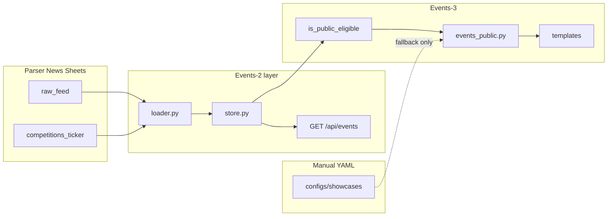

# Events PR-3 — Public UI (Implementation Package)

**Status:** GM **APPROVED WITH CORRECTIONS** — package updated; implementation may start after merge to `develop`  
**Date:** 2026-06-13 (revised per GM review)  
**Base branch:** `develop` (after Events-2 merge `fae6a49b`)  
**Depends on:** Events-1 (classifier/schema), Events-2 (loader/store/serializer/API)  
**Implementation branch (after package merge):** `events-3-public-ui` → PR target `develop`

**Production:** observe mode — no deploy, no merge to `main`, all `EVENTS_*` flags remain **OFF** until a dedicated GM window.

---

## 1. Goal

Replace the **static YAML-only** `/events` vitrine with a **flag-gated public UI** backed by the Events-2 read model (Sheets → classify → filter), without:

- autopublish to blog/ticker;
- parser/cron changes;
- blog publishability wiring;
- POST review override;
- production deploy.

Public pages must **never** expose `needs_review` rows, raw bodies, source URLs, or PII-like fields.

---

## 2. GM guardrails (carry forward)

| Rule | Events-3 |
|------|----------|
| Merge target | `develop` only |
| Production deploy | **Not approved** |
| `main` merge | **Not approved** |
| Enable `EVENTS_*` on prod | **Not approved** |
| Parser Bot / cron | Out of scope |
| Social-2 / Telegram bot | Out of scope |
| POST `/api/events/review/.../override` | Deferred (Events-2b / admin PR) |

---

## 3. Route decisions

### 3.1 `/events` — list vitrine

| Aspect | Behavior |
|--------|----------|
| **`EVENTS_PUBLIC_UI_ENABLED=0`** | **Current YAML path unchanged** — `get_event_cards()` / `get_events_schema()`; **no regression** |
| **`EVENTS_PUBLIC_UI_ENABLED=1`** + API ON | Server-render from Events-2 **store layer** (`get_public_items()`), not HTTP self-call |
| **Default public filter** | `is_public_eligible(item) == true` (see §5) |
| **Query params** | `type` (alias `content_type`), `city`, `from`, `to` — shareable URLs |
| **Layout** | Card grid + filter bar (desktop); collapsible filters (mobile) |
| **Pagination** | Server-side `limit`/`offset` or “load more” (max 50 per page) |

**URL examples:**

```text
/events
/events?type=competition
/events?type=camp&city=Сочи
/events?from=2026-06-01&to=2026-12-31
```

### 3.2 `/events/<slug>` — detail page (flag-gated)

**MVP slug format (GM accepted):**

```text
{title-slug}-{event_id_tail}
```

**Canonical identity rule (required):**

| Concept | Rule |
|---------|------|
| **`event_id`** | Canonical identity — lookup primary key |
| **Slug** | Derived from title + `event_id_tail`; **may change** when title changes |
| **Lookup** | Resolve by `event_id_tail` (suffix match) **and** validate slug; do not rely on title slug alone |
| **Title/slug mismatch** | If item found by `event_id_tail` but URL title slug differs → **301 redirect** to canonical `/events/{current_slug}` or emit canonical URL in `<link rel="canonical">` |
| **Collision** | Impossible by design: `event_id_tail` is unique per row; slug always includes tail |

**404** when: item missing, not public-eligible, or `EVENTS_PUBLIC_UI_ENABLED=0`.

Detail page fields (public-safe, extended vs list):

- `title`, dates, city, location_name, sport_type, content_type
- `short_description` (truncated, sanitized — **not** raw HTML body)
- cover image if `media_status=ok` and URL is not t.me page
- CTA: registration link only if explicitly `published` + URL validated

Future upgrade: explicit Sheet `slug` column (Events-4) — still keyed by `event_id`.

### 3.3 `/competitions` — redirect, not separate catalog

```text
GET /competitions  →  redirect  →  /events?type=competition
```

| Stage | Status code | When |
|-------|-------------|------|
| **Staging / MVP / pre-prod** | **302** (temporary) | Until GM prod launch sign-off |
| **After GM prod launch approval** | **301** (permanent) | Production SEO window only |

Register redirect **only when** `EVENTS_PUBLIC_UI_ENABLED=1`.  
If `/competitions` never existed publicly before — **302 first** avoids locking in a bad SEO redirect before validation.

### 3.4 Legacy routes

| Route | Events-3 action |
|-------|-----------------|
| `/content/events_list` | No touch; deprecate in Events-4 |
| Home `#events` empty months | **Optional Events-3b** — wire to store or hide block |

---

## 4. Data source architecture



**Rule:** Public SSR routes call **`store.get_public_items()` / `resolve_item_by_slug()`** directly (same read model as API).  
Do **not** HTTP-fetch `/api/events` from Flask.

### 4.1 YAML merge policy (GM corrected — no chaotic mixing)

| Flag state | Source |
|------------|--------|
| **`EVENTS_PUBLIC_UI_ENABLED=0`** | YAML only — **unchanged current path** |
| **`EVENTS_PUBLIC_UI_ENABLED=1`** | **Events-2 read-model is primary** |

**If YAML items appear in the new vitrine:**

1. YAML rows **must** pass through the same **normalized model + public serializer** (not ad-hoc dict merge).
2. **Dedup** before render: by `event_id`, `source_id`, `source_url`, or checksum — **never show duplicate** camp/event from YAML and Sheets.
3. If YAML → normalized model adapter is **not ready in Events-3** → YAML is **fallback only** when store returns zero public-eligible items (with banner “расписание обновляется”).
4. **Never** interleave unnormalized YAML cards alongside store cards without dedup.

---

## 5. Public eligibility (`needs_review` policy)

**Hard rule (GM):**

```text
needs_review never appears on public list or detail
```

Public UI shows **only** public-eligible items.

### 5.1 `is_public_eligible(item)` — required function

Implement in `app/services/events/public_eligibility.py` (or `store.py`):

```python
def is_public_eligible(item: NormalizedContentItem) -> bool:
    """
    Minimum: track_status != needs_review
    Full rule: published + classifier OK + required fields present
    """
```

| Check | Rule |
|-------|------|
| Minimum (required) | `track_status != "needs_review"` |
| Classifier | `classification.needs_review is False` |
| Status | `track_status == "published"` |
| Draft/parsed/archived | **Excluded** from public list |
| Missing title | **Excluded** |
| Missing start_date for competition/event | **Excluded** (already `needs_review` in classifier) |

**All public list/detail paths must call `is_public_eligible()` — single gate, unit-tested.**

Operator review remains on **`GET /api/events/review-queue`** (Events-2, internal/staging only).

**No autopublish:** classifier never promotes row to `published` on Site.

---

## 6. Feature flags (default OFF)

```text
EVENTS_CLASSIFIER_ENABLED=0      # Events-1 — unchanged
EVENTS_API_ENABLED=0             # Events-2 — unchanged
EVENTS_REVIEW_API_ENABLED=0      # Events-2 — unchanged
EVENTS_PUBLIC_UI_ENABLED=0       # NEW — gates dynamic vitrine + detail + /competitions redirect
```

### 6.1 Flag dependency (GM hard rule)

```text
EVENTS_PUBLIC_UI_ENABLED=1  REQUIRES  EVENTS_API_ENABLED=1
```

Enforce in `app/config/events_features.py`:

```python
def is_events_public_ui_enabled() -> bool:
    return is_events_api_enabled() and _env_flag("EVENTS_PUBLIC_UI_ENABLED")
```

### 6.2 Flag behavior matrix

| `EVENTS_PUBLIC_UI_ENABLED` | `EVENTS_API_ENABLED` | Behavior |
|----------------------------|----------------------|----------|
| `0` | any | `/events` = **current YAML**; `/events/<slug>` → 404; `/competitions` → 404; **no regression** |
| `1` | `0` | **No 500** — graceful fallback: render YAML path **or** 503/404 per route (list → YAML fallback preferred; detail → 404) |
| `1` | `1` | Dynamic vitrine from store; detail + redirect active |

New detail routes **must not break** existing site when flags OFF.

---

## 7. Home ticker links (in scope)

**Do not break** existing home `#competitions-ticker` behavior.

| Condition | Link target |
|-----------|-------------|
| `EVENTS_PUBLIC_UI_ENABLED=1` + item is public-eligible + detail URL resolvable | `/events/{slug}` |
| Detail URL not available | Keep current `event_url` / `source_url` / existing ticker behavior |
| **Never** | Generate broken `/events/<slug>` links |

Implementation: helper `public_detail_url(item) -> Optional[str]` — returns `None` if not eligible → ticker keeps legacy link.

---

## 8. Empty and fallback states

| State | UX |
|-------|-----|
| Zero public-eligible items | `#no-events-modal` + links to `/blog`, contacts |
| Filter returns empty | “Нет мероприятий по фильтру” + reset filters |
| Sheets load failure | Log warning; YAML fallback (if flag allows) OR friendly error — **no 500, no stack trace** |
| `PUBLIC_UI=1`, `API=0` | YAML fallback or 503 — **no 500** |
| Flag OFF | Existing static page unchanged |

---

## 9. Mobile layout

| Element | Mobile behavior |
|---------|-----------------|
| Filter bar | Collapse to “Фильтры” drawer / `<details>` |
| Event cards | Single column, full-width |
| Dates | `start_date`–`end_date` compact (`ru-RU`) |
| CTA buttons | Min tap target 44px |
| Detail page | Hero optional; sticky CTA if registration URL |

CSS: extend `.events-section` / `.event-card`; optional `events-vitrine.css`.

---

## 10. SEO and schema.org (GM corrected domain)

**Canonical production domain:**

```text
https://mywavewake.ru
```

**Do not use** `mywavetreaning.ru` in Events-3 canonical URLs, sitemap, or JSON-LD.

| Page | SEO |
|------|-----|
| `/events` | title + meta description; canonical `https://mywavewake.ru/events` |
| `/events?type=competition` | canonical query URL on same domain |
| `/events/<slug>` | per-event title; canonical `https://mywavewake.ru/events/{slug}` |

**JSON-LD:** `ItemList` (list) / `Event` (detail) with `startDate`, `endDate`, `location`, `eventStatus`.  
Omit events without `start_date` from JSON-LD.

**Sitemap:** add `/events` + published detail slugs when flag ON (domain `mywavewake.ru`).

---

## 11. Proposed PR split

| PR | Scope |
|----|--------|
| **Events-3** | Flags, eligibility, slug, public routes, templates, ticker links, `/competitions` 302, tests |
| **Events-3b** (optional) | Home `#events` block, sitemap slugs bulk, YAML normalized merge, 301 upgrade after prod sign-off |

Single PR **Events-3** acceptable if ≤ ~700 LOC.

---

## 12. Affected files (planned)

| File | Action |
|------|--------|
| `app/config/events_features.py` | `EVENTS_PUBLIC_UI_ENABLED`, strict API dependency |
| `app/services/events/public_eligibility.py` | **new** — `is_public_eligible()` |
| `app/services/events/slug.py` | **new** — derive, resolve by `event_id_tail`, canonical redirect |
| `app/services/events/public_serializer.py` | **new** — SSR-safe fields |
| `app/services/events/store.py` | `get_public_items()`, `resolve_item_by_slug()` |
| `app/routes/events_public.py` | **new** — routes + redirect |
| `app/__init__.py` | Gate `events_page()`; register blueprint |
| `templates/events.html` | Dynamic list + filters + empty states |
| `templates/events_detail.html` | **new** — detail + JSON-LD + canonical |
| `templates/partials/home_competitions_ticker.html` | Conditional detail links |
| `static/js/events-vitrine.js` | Optional filter UX |
| `static/css/events-vitrine.css` | Mobile filters |
| `templates/sitemap.xml` | Conditional URLs on `mywavewake.ru` |
| `env.example` | Document flag |
| `tests/unit/test_events_public_eligibility.py` | **new** |
| `tests/unit/test_events_public_routes.py` | **new** |
| `tests/unit/test_events_public_serializer.py` | **new** |
| `tests/unit/test_events_slug.py` | **new** |
| `docs/integration/EVENTS_PR3_PUBLIC_UI.md` | Evidence (post-implementation) |

**Not touched:** `app/services/blog/store.py`, parser cron, Telegram, booking.

---

## 13. Required tests (GM mandatory)

```bash
python -m pytest \
  tests/unit/test_events_public_eligibility.py \
  tests/unit/test_events_slug.py \
  tests/unit/test_events_public_routes.py \
  tests/unit/test_events_public_serializer.py \
  tests/unit/test_events_api.py \
  tests/unit/test_event_classifier.py \
  -q
```

| # | Test case | Expectation |
|---|-----------|-------------|
| 1 | Flag OFF | `/events` YAML behavior **unchanged** (same cards/schema path) |
| 2 | Flag ON + API ON | `/events` lists public-eligible store items only |
| 3 | `needs_review` | **Not** in public list |
| 4 | `needs_review` detail | **404** (or redirect away) |
| 5 | `is_public_eligible()` | Unit tests for min rule + full rule |
| 6 | Slug generation | Stable for same `event_id` + title |
| 7 | Slug collision | Protected by unique `event_id_tail` |
| 8 | Title change | Old slug URL → **301** to new canonical slug |
| 9 | `/competitions` | **302** → `/events?type=competition` when flag ON |
| 10 | Empty state | Renders without 500 |
| 11 | Mobile markup | Smoke: filter `<details>`, card structure present |
| 12 | Serializer safety | No raw source payload, source_url, PII in HTML/JSON-LD |
| 13 | `PUBLIC_UI=1`, `API=0` | No 500; graceful fallback |
| 14 | Ticker links | No broken `/events/<slug>` when item not eligible |
| 15 | Regression | Events-2 API tests still pass |

---

## 14. Out of scope (explicit)

- Blog publishability / `raw_feed` ingest changes
- Parser Bot / cron (Events-4)
- Autopublish, POST override, admin review UI
- Production deploy / `main` merge / `.env` prod / flags ON on prod
- Social-2, Telegram bot, Node restart
- `/competitions` **301** until GM prod launch sign-off (use 302 first)

---

## 15. Risks and mitigations

| Risk | Mitigation |
|------|------------|
| YAML + Sheets duplicates | Dedup + normalized model; fallback-only if adapter missing |
| Slug drift on title edit | `event_id` lookup + 301 to canonical |
| Leak `needs_review` | `is_public_eligible()` single gate + tests |
| Flag ON without API | Dependency + YAML fallback, no 500 |
| Broken ticker links | `public_detail_url()` returns None → legacy URL |
| Wrong canonical domain | Hardcode config constant `PUBLIC_SITE_BASE_URL=https://mywavewake.ru` for Events-3 |

---

## 16. GM approval checklist

- [x] Route set: `/events`, `/events/<slug>`, `/competitions` redirect
- [x] Slug MVP: `{title-slug}-{event_id_tail}`; `event_id` canonical
- [x] Flag dependency: `EVENTS_PUBLIC_UI_ENABLED=1` requires `EVENTS_API_ENABLED=1`
- [x] Public eligibility: `is_public_eligible()` + tests
- [x] YAML: store-primary; normalized merge or fallback-only
- [x] Ticker links: no broken slugs
- [x] Canonical domain: `https://mywavewake.ru`
- [x] `/competitions`: 302 staging, 301 after prod sign-off
- [x] No production deploy; PR target `develop` only

**Implementation may start on branch `events-3-public-ui` after this package merges to `develop`.**

---

## 17. Evidence template (post-implementation)

```text
Branch: events-3-public-ui
Commit:
PR title/link:
Target branch: develop
Flags default OFF: EVENTS_PUBLIC_UI_ENABLED=0
Canonical domain: https://mywavewake.ru
is_public_eligible tested: yes/no
needs_review hidden: yes/no
/competitions redirect (302): yes/no
Flag OFF YAML unchanged: yes/no
PUBLIC_UI=1 API=0 no 500: yes/no
Tests command/result:
No parser/cron: yes/no
No production changes: yes/no
main unchanged: yes/no
```
