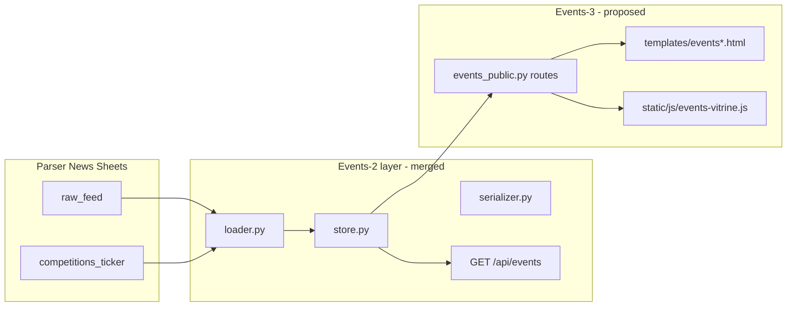

# Events PR-3 — Public UI (Implementation Package)

**Status:** Draft — pre-code, GM review required before implementation  
**Date:** 2026-06-13  
**Base branch:** `develop` (after Events-2 merge `fae6a49b`, implementation commit `53a1a0c5`)  
**Depends on:** Events-1 (classifier/schema), Events-2 (loader/store/serializer/API)

**Production:** observe mode — no deploy, no merge to `main`, all `EVENTS_*` flags remain **OFF** until a dedicated GM window.

---

## 1. Goal

Replace the **static YAML-only** `/events` vitrine with a **flag-gated public UI** backed by the Events-2 read model (Sheets → classify → filter), without:

- autopublish to blog/ticker;
- parser/cron changes;
- blog publishability wiring;
- POST review override;
- production deploy.

Public pages must **never** expose `needs_review` rows, raw bodies, source URLs, or PII-like fields.

---

## 2. GM guardrails (carry forward)

| Rule | Events-3 |
|------|----------|
| Merge target | `develop` only |
| Production deploy | **Not approved** |
| `main` merge | **Not approved** |
| Enable `EVENTS_*` on prod | **Not approved** |
| Parser Bot / cron | Out of scope |
| Social-2 / Telegram bot | Out of scope |
| POST `/api/events/review/.../override` | Deferred (Events-2b / admin PR) |

---

## 3. Route decisions (proposed for GM sign-off)

### 3.1 `/events` — list vitrine (replace static-only behavior when flag ON)

| Aspect | Proposal |
|--------|----------|
| **When flag OFF** | Keep **current** behavior: YAML showcases via `get_event_cards()` / `get_events_schema()` — no regression |
| **When flag ON** | Server-render list from Events-2 **store layer** (`list_items`), not HTTP self-call |
| **Default filter** | Upcoming items with `track_status=published` only; exclude `needs_review`, `draft`, `archived` |
| **Query params** | `type` (alias `content_type`), `city`, `from`, `to` — mirror API filters for shareable URLs |
| **Layout** | Card grid + filter bar (desktop); collapsible filters (mobile) |
| **Pagination** | Server-side `limit`/`offset` or “load more” (max 50 per page) |

**URL examples:**

```text
/events
/events?type=competition
/events?type=camp&city=Сочи
/events?from=2026-06-01&to=2026-12-31
```

### 3.2 `/events/<slug>` — detail page (**new**, flag-gated)

| Option | Recommendation | Rationale |
|--------|----------------|-----------|
| A. Slug from Sheet `slug` column | Preferred if column populated | Aligns with blog `/blog/{slug}` |
| B. Deterministic slug `{title-slug}-{event_id_tail}` | **Fallback MVP** | No parser change required |
| C. Opaque `/events/id/<event_id>` | Reject for SEO | Poor canonical URLs |

**GM proposal:** implement **B** for MVP; upgrade to **A** when Parser News adds `slug` to ticker/raw rows (Events-4).

Detail page fields (public-safe, extended vs list):

- `title`, dates, city, location_name, sport_type, content_type
- `short_description` (truncated, sanitized — **not** raw HTML body)
- cover image if `media_status=ok` and URL is not t.me page
- CTA: registration link only if explicitly `published` + URL validated

**404** when: item missing, `needs_review`, not `published`, or flag OFF (same as list).

### 3.3 `/competitions` — redirect, not separate catalog

**Recommendation (from EVENTS-0 audit):**

```text
GET /competitions  →  301  →  /events?type=competition
```

| Alternative | Verdict |
|-------------|---------|
| Separate `/competitions` template | Reject — duplicates vitrine |
| Keep 404 | Reject — breaks user/bookmark expectations |

Register redirect **only when** `EVENTS_PUBLIC_UI_ENABLED=1`.

### 3.4 Legacy routes (no change in Events-3)

| Route | Events-3 action |
|-------|-----------------|
| `/content/events_list` | No touch; deprecate in Events-4 |
| Home ticker `#competitions-ticker` | Optional: link cards to `/events/<slug>` when flag ON (separate small PR if scope tight) |
| Home `#events` empty months | **Optional Events-3b** — wire to store or hide block until data exists |

---

## 4. Data source architecture



**Rule:** Public SSR routes call **`store.list_items()` / `get_item_by_slug()`** directly (same read model as API).  
Do **not** HTTP-fetch `/api/events` from Flask unless needed for client-side hydration tests.

**YAML coexistence (transition):**

| Phase | Behavior |
|-------|----------|
| Flag OFF | YAML only (current) |
| Flag ON, staging | API/store items **primary**; YAML manual camps merged with `source_hint=manual` if GM approves |
| Flag ON, prod (future window) | Same; YAML entries migrated to Sheets over time |

Events-3 MVP: **store-only list**; YAML merge is **optional** sub-task — default **API/store wins**, YAML shown only when store empty (fallback banner).

---

## 5. `needs_review` and publish policy (public)

| Condition | Public UI |
|-----------|-----------|
| `classification.needs_review=true` | **Hidden** — never in list or detail |
| `track_status=needs_review` | **Hidden** |
| `track_status=draft` / `parsed` | **Hidden** |
| `track_status=published` + classifier OK | **Visible** |
| `track_status=archived` | Hidden (or “past events” section — **defer** to Events-3b) |

Operator review remains on **`GET /api/events/review-queue`** (Events-2, internal/staging only).

**No autopublish:** classifier never promotes row to `published` on Site; editorial action stays in Sheets / future admin PR.

---

## 6. Empty and fallback states

Reuse patterns from current `templates/events.html`:

| State | UX |
|-------|-----|
| Zero published items | `#no-events-modal` + links to `/blog`, contacts |
| Filter returns empty | Inline message “Нет мероприятий по фильтру” + reset filters |
| Sheets load failure | Log warning; show YAML fallback if configured OR friendly error (no stack trace) |
| Flag OFF | Existing static page / empty YAML cards |

Copy (RU): consistent with home ticker tone — “готовим расписание”, no false dates.

---

## 7. Mobile layout

| Element | Mobile behavior |
|---------|-----------------|
| Filter bar | Collapse to “Фильтры” drawer / `<details>` |
| Event cards | Single column, full-width |
| Dates | `start_date`–`end_date` compact format (locale `ru-RU`) |
| CTA buttons | Min tap target 44px; stack vertically |
| Detail page | Hero image optional; sticky “Записаться” if registration URL present |

CSS: extend existing `.events-section` / `.event-card` in `static/css/` (minimal new file `events-vitrine.css` if needed).

---

## 8. SEO and schema.org Event plan

**Canonical domain:** `https://mywavetreaning.ru` (per site-publisher-context).

| Page | SEO |
|------|-----|
| `/events` | `<title>Мероприятия и соревнования — MyWave</title>`, meta description, canonical `/events` |
| `/events?type=competition` | canonical to `/events?type=competition` (no duplicate `/competitions` index) |
| `/events/<slug>` | per-event title, canonical `{base}/events/{slug}` |

**JSON-LD:**

- List page: `ItemList` of `Event` references (or single graph `@graph`)
- Detail page: full `Event` with `startDate`, `endDate`, `location` (`Place`), `eventStatus`, `eventAttendanceMode`
- Omit events without `start_date` from JSON-LD (already excluded from public list)

**Sitemap:** add `/events` and published detail slugs to `sitemap.xml` generator **when flag ON** (fix E-10 from audit).

**Robots:** no index for review-queue or diagnostic URLs (API-only).

---

## 9. Feature flags (default OFF)

```text
EVENTS_CLASSIFIER_ENABLED=0      # Events-1 — unchanged
EVENTS_API_ENABLED=0             # Events-2 — unchanged
EVENTS_REVIEW_API_ENABLED=0      # Events-2 — unchanged
EVENTS_PUBLIC_UI_ENABLED=0       # NEW — gates /events dynamic vitrine + /events/<slug> + /competitions redirect
```

**Dependency chain:**

```text
EVENTS_PUBLIC_UI_ENABLED=1  →  requires EVENTS_API_ENABLED=1  (store load path shared)
```

When `EVENTS_PUBLIC_UI_ENABLED=0`:

- `/events` behaves as today (YAML);
- `/events/<slug>` → **404** (or redirect `/events`);
- `/competitions` → **404** (no redirect).

Implementation may register routes always but gate at view level (consistent with Events-2 **503** vs public **404** — use **404** for public routes to avoid leaking feature existence).

---

## 10. Proposed PR split

| PR | Scope |
|----|--------|
| **Events-3a** | Flags, `events_public.py`, store `get_by_slug`, list + detail templates, `/competitions` redirect, tests |
| **Events-3b** (optional) | Home `#events` block, ticker deep links, sitemap slugs, YAML merge |

Single PR **Events-3** acceptable if ≤ ~600 LOC; prefer **3a only** for first GM review.

---

## 11. Affected files (planned)

| File | Action |
|------|--------|
| `app/config/events_features.py` | Add `EVENTS_PUBLIC_UI_ENABLED`, `is_events_public_ui_enabled()` |
| `app/routes/events_public.py` | **new** — `/events`, `/events/<slug>`, `/competitions` redirect |
| `app/services/events/store.py` | Extend — `get_public_items()`, `get_item_by_slug()`, public filter preset |
| `app/services/events/public_serializer.py` | **new** — SSR-safe fields (+ short_description rules) |
| `app/services/events/slug.py` | **new** — slug derive / resolve |
| `app/__init__.py` | Register blueprint; gate or replace inline `events_page()` |
| `templates/events.html` | Dynamic list + filters + empty states |
| `templates/events_detail.html` | **new** — detail + JSON-LD |
| `static/js/events-vitrine.js` | **new** — filter UX (optional progressive enhancement) |
| `static/css/events-vitrine.css` | **new** — mobile filters (if needed) |
| `templates/sitemap.xml` | Conditional `/events` + detail URLs |
| `env.example` | Document `EVENTS_PUBLIC_UI_ENABLED` |
| `tests/unit/test_events_public_routes.py` | **new** |
| `tests/unit/test_events_public_serializer.py` | **new** |
| `docs/integration/EVENTS_PR3_PUBLIC_UI.md` | Evidence doc (post-implementation) |

**Not touched:** `app/services/blog/store.py`, parser cron, `events_api.py` contract, Telegram, booking.

---

## 12. Test plan

```bash
python -m pytest tests/unit/test_events_public_routes.py tests/unit/test_events_public_serializer.py tests/unit/test_events_api.py tests/unit/test_event_classifier.py -q
```

| Case | Expectation |
|------|-------------|
| Flags OFF | `/events` → legacy YAML path; `/events/foo` → 404 |
| Flag ON | `/events` lists only `published`, not `needs_review` |
| `/competitions` | 301 → `/events?type=competition` when flag ON |
| Detail slug | 200 for published; 404 for needs_review |
| Serializer | No raw body, source_url, PII keys in HTML/JSON-LD |
| Empty store | Fallback UI renders without 500 |
| Regression | Events-2 API tests still pass |

---

## 13. Out of scope (explicit)

- Blog publishability / `raw_feed` ingest changes
- Parser Bot / cron / new Sheet columns (Events-4)
- Autopublish to ticker or blog
- POST review override
- Admin UI for review queue
- Production deploy / `main` merge / `.env` prod changes
- Social-2, Telegram bot, Node restart
- Full replacement of `/projects/*` camp landings

---

## 14. Risks

| Risk | Mitigation |
|------|------------|
| YAML vs Sheets duplicate entries | Default store-primary; document manual dedup |
| Missing slug column | Deterministic slug helper + tests |
| SEO duplicate `/competitions` | 301 only, single canonical list |
| Leak `needs_review` | Hard filter in `get_public_items()` + tests |
| Scope creep into home/ticker | Defer to Events-3b |
| Flag ON without API flag | Enforce dependency in `events_features.py` |

---

## 15. GM approval checklist (before coding)

- [ ] Approve route set: `/events`, `/events/<slug>`, `/competitions` → 301
- [ ] Approve slug strategy (deterministic MVP vs Sheet `slug`)
- [ ] Approve flag name `EVENTS_PUBLIC_UI_ENABLED` + dependency on `EVENTS_API_ENABLED`
- [ ] Approve public filter: `published` only, hide `needs_review`
- [ ] Approve YAML fallback policy when store empty
- [ ] Approve SEO/sitemap scope for Events-3a vs 3b
- [ ] Confirm **no production deploy** for Events-3 PR
- [ ] Confirm PR targets **`develop` only**

---

## 16. Evidence template (post-implementation)

```text
Branch:
Commit:
PR title/link:
Target branch: develop
Flags default OFF: EVENTS_PUBLIC_UI_ENABLED=0
Routes added:
needs_review hidden:
/competitions redirect:
Tests command/result:
No parser/cron:
No blog wiring:
No production changes:
main unchanged:
```

Expected test command:

```bash
python -m pytest tests/unit/test_events_public_routes.py tests/unit/test_events_public_serializer.py tests/unit/test_events_api.py tests/unit/test_event_classifier.py -q
```
