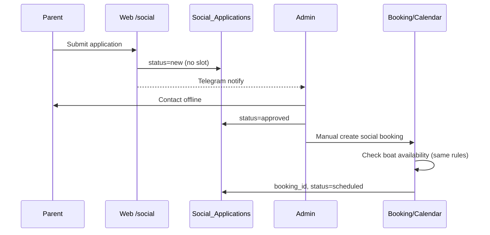

# SOCIAL-0 — MyWave Social Mission Implementation Package

**Track:** TRACK B — Social Mission (independent from Phase 2 booking, independent from Events)  
**Status:** SOCIAL-0 planning package (pre-code)  
**Date:** 2026-06-12  
**Production mode:** **OBSERVE** — all flags **OFF**; no server changes until GM approves **PR Social-1**

**Hard rule:** Social application **must NOT** auto-occupy commercial boat-slots.

---

## Executive summary

MyWave Social Mission — отдельный модуль заявок для социальных тренировок на катере. MVP без web-admin: **Google Sheets registry + Telegram admin notification**. Booking создаётся **только вручную администратором** после `approved`, с проверкой доступности слота по тем же правилам, что коммерческая запись.

**Deliverable now:** design + PR plan only. **No code, no `.env`, no flags enabled.**

---

## 1. Final PR plan

| PR | Scope | Public UI | Booking | Prod flags |
|----|-------|-----------|---------|------------|
| **Social-1** | Data layer, flags, Sheets write, tests | ❌ | ❌ | All OFF |
| **Social-2** | `/social`, form, JS/CSS, Telegram notify | ✔ apply only | ❌ | `SOCIAL_MODULE_ENABLED`, `SOCIAL_APPLICATIONS_ENABLED`, `SOCIAL_ADMIN_NOTIFICATIONS_ENABLED` (staging first) |
| **Social-3** | `booking_type=social`, manual schedule | Admin flow | ✔ manual | + staging booking integration |
| **Social-4** | Home widget, `/api/social/stats` | Widget + stats | ❌ | `SOCIAL_WIDGET_ENABLED`, `SOCIAL_PUBLIC_STATS_ENABLED` |
| **Social-5** | Legal docs hub, consent versions | Docs routes | ❌ | Legal sign-off before prod ON |

**GM gate:** approve **Social-1** separately before any merge to main deploy.

---

## 2. Affected files (planned)

### New files (required by GM)

| File | Purpose |
|------|---------|
| `app/routes/social.py` | Public routes + API |
| `app/services/social_store.py` | Sheets CRUD for applications/sessions |
| `app/services/social_stats.py` | Aggregated public counters |
| `app/services/social_booking.py` | Manual social booking orchestration |
| `app/services/social_documents.py` | Consent/rules doc metadata + versions |
| `templates/social.html` | Landing + form |
| `templates/partials/social_widget.html` | Home widget partial |
| `static/js/social.js` | Form UX, validation, fetch |
| `static/css/social.css` | Module styles |

### Existing files (touch in later PRs)

| File | Change |
|------|--------|
| `app/__init__.py` | Register `social_bp`; widget context when flagged |
| `config.py` / `.env.example` | Social flags + sheet names |
| `templates/index.html` | Include widget partial (flag-gated) |
| `templates/base.html` | Nav link to `/social` (flag-gated) |
| `app/routes/calendar_routes.py` | Accept `booking_type=social` on admin create path only |
| `app/services/booking/calendar_writer.py` | Summary line for social sessions |
| `app/services/notifications.py` | Reuse `send_telegram_notification` pattern |
| `tests/unit/test_social_*.py` | Store, validation, flags |
| `tests/integration/test_social_apply.py` | POST apply → Sheets mock |

**Explicitly NOT in Social-1..2:** changes to Phase 2 booking flags, public calendar slot mutation on apply.

---

## 3. Google Sheets tabs

Spreadsheet: **recommend dedicated tab set** in existing Admin spreadsheet (`SPREADSHEET_ID`) **or** separate `SOCIAL_SPREADSHEET_ID` (GM decision). Default proposal: **same Admin spreadsheet**, isolated tabs — avoids Parser News mix-up.

### Tab: `Social_Applications`

| Column | Type | Required | Notes |
|--------|------|----------|-------|
| `application_id` | string | ✔ | `soc_app_{uuid}` |
| `created_at` | ISO datetime | ✔ | UTC |
| `updated_at` | ISO datetime | ✔ | |
| `status` | enum | ✔ | `new` / `review` / `approved` / `rejected` / `scheduled` / `closed` |
| `parent_name` | string | ✔ | |
| `parent_phone` | string | ✔ | E.164 normalized |
| `parent_email` | string | optional | |
| `child_first_name` | string | ✔ | First name only publicly forbidden |
| `child_age` | int | ✔ | |
| `city` | string | optional | |
| `preferred_contact` | enum | ✔ | phone / telegram / email |
| `telegram_username` | string | optional | |
| `health_notes` | string | optional | **Safety-oriented only** — see §9 |
| `motivation_text` | string | optional | Why social program |
| `consent_personal_data` | bool | ✔ | version id |
| `consent_training` | bool | ✔ | version id |
| `consent_media` | bool | optional | separate media consent |
| `consent_version` | string | ✔ | e.g. `2026-06-v1` |
| `source` | string | ✔ | `web_social_form` |
| `ip_hash` | string | optional | salted hash, not raw IP |
| `assigned_admin` | string | optional | |
| `booking_id` | string | optional | Filled Social-3 |
| `internal_notes` | string | optional | Admin only |

### Tab: `Social_Sessions`

| Column | Type | Notes |
|--------|------|-------|
| `session_id` | string | `soc_sess_{uuid}` |
| `application_id` | string | FK |
| `scheduled_date` | date | |
| `scheduled_time` | time | |
| `service` | string | `boat` (fixed for MVP) |
| `booking_id` | string | Calendar/Sheets booking ref |
| `calendar_event_id` | string | optional |
| `status` | enum | `planned` / `completed` / `cancelled` |
| `created_at` | datetime | |
| `created_by` | string | admin id |

### Tab: `Social_Impact`

Aggregated metrics (written by batch job or admin):

| Column | Type |
|--------|------|
| `metric_key` | string |
| `metric_value` | number |
| `period` | string |
| `updated_at` | datetime |

Examples: `sessions_completed_total`, `applications_approved_total`, `hours_on_water_total`.

### Tab: `Social_Audit_Log`

| Column | Type |
|--------|------|
| `event_id` | string |
| `timestamp` | ISO |
| `actor` | admin/system |
| `action` | string |
| `application_id` | string |
| `payload_summary` | string (no PII) |

---

## 4. Feature flags

All **default OFF** on production.

```text
SOCIAL_MODULE_ENABLED=false
SOCIAL_WIDGET_ENABLED=false
SOCIAL_APPLICATIONS_ENABLED=false
SOCIAL_PUBLIC_STATS_ENABLED=false
SOCIAL_ADMIN_NOTIFICATIONS_ENABLED=false
```

| Flag | Gates |
|------|-------|
| `SOCIAL_MODULE_ENABLED` | Master switch; blueprint registration |
| `SOCIAL_APPLICATIONS_ENABLED` | `POST /api/social/apply`, form active |
| `SOCIAL_ADMIN_NOTIFICATIONS_ENABLED` | Telegram on new application |
| `SOCIAL_WIDGET_ENABLED` | Home partial `social_widget.html` |
| `SOCIAL_PUBLIC_STATS_ENABLED` | `GET /api/social/stats` |

**Staging:** enable per-PR for QA; prod remains OFF until Social-5 + GM sign-off.

Implementation pattern: mirror `BOOKING_PHASE2_*` — read from env in `config.py`, check in routes/services.

---

## 5. Form fields (public `/social`)

| Field | UI | Required | Storage |
|-------|-----|----------|---------|
| Parent/guardian full name | text | ✔ | `parent_name` |
| Phone | tel | ✔ | `parent_phone` |
| Email | email | ❌ | `parent_email` |
| Child first name | text | ✔ | `child_first_name` |
| Child age | number 6–17 | ✔ | `child_age` |
| City | text | ❌ | `city` |
| Preferred contact method | select | ✔ | `preferred_contact` |
| Telegram @username | text | conditional | `telegram_username` |
| Short motivation | textarea | ❌ | `motivation_text` |
| Health/safety notes | textarea | ❌ | `health_notes` — placeholder: «аллергии, необходимость спасжилета…» |
| PD consent checkbox | checkbox + link | ✔ | `consent_personal_data` |
| Training consent checkbox | checkbox + link | ✔ | `consent_training` |
| Media consent checkbox | checkbox + link | ❌ | `consent_media` |

**Not on form (forbidden):** passport, SNILS, diagnosis, disability as required, document uploads, medical records.

---

## 6. Validation rules

| Rule | Server |
|------|--------|
| All `SOCIAL_*` flags for action must be ON | 503 if module disabled |
| CSRF on form POST | Flask-WTF |
| Rate limit `POST /api/social/apply` | 5/min per IP (match safari forms) |
| Phone | Normalize RU; min 10 digits |
| Email | RFC5322 lite if present |
| Child age | Integer 6–17 (configurable constant) |
| `health_notes` | Max 500 chars; reject if contains passport-like patterns (optional) |
| Consents | Must be `true` for required docs |
| Duplicate flood | Same phone + same day → 409 or idempotent ack |
| **No slot/date on apply** | Reject if client sends `date`/`time`/`slot` |

---

## 7. Telegram admin notification plan

Reuse: `app/services/notifications.py` → `send_telegram_notification`.

**Trigger:** successful `Social_Applications` row insert, if `SOCIAL_ADMIN_NOTIFICATIONS_ENABLED=1`.

**Message template (no PII in logs):**

```text
🌊 Social Mission — новая заявка
ID: soc_app_…
Статус: new
Возраст ребёнка: {age}
Город: {city or "—"}
Контакт: {preferred_contact}
→ Sheets: Social_Applications
```

**Do NOT include in Telegram:** full parent name, phone, child name, health_notes (admin opens Sheets).

**Credentials:** existing `TELEGRAM_BOT_TOKEN` + admin chat (`TELEGRAM_CHAT_ID` / `ADMIN_CHAT_ID`) — same as booking leads. **Separate token optional** later (`SOCIAL_TELEGRAM_CHAT_ID`).

**Failure policy:** Sheets write succeeds even if Telegram fails; log `social_notify_failed` with `application_id`.

---

## 8. Booking integration plan (Social-3 only)

### Flow



### Booking fields (extend existing booking row)

| Field | Value |
|-------|-------|
| `booking_type` | `social` |
| `price` | `0` |
| `payment_status` | `social_pool` |
| `application_id` | `soc_app_…` |
| `service` | `boat` |

### Integration points

- **Manual admin only:** no public API to create booking from application in MVP.
- Reuse slot check: `get_available_slots()` / calendar pipeline from `app/routes/calendar_routes.py`.
- Calendar writer: distinct summary prefix «Social Mission» + `(WEB_ID: …)` pattern unchanged.
- **Guard:** `social_booking.create_from_application()` requires `application.status == approved`.

### What public apply must NOT do

- Call `/api/calendar/slots` to hold slot
- POST to `/api/booking/create`
- Write Calendar event

---

## 9. Privacy / safety constraints

| Rule | Implementation |
|------|----------------|
| No passport / scans / medical docs on public form | Form + server reject |
| No required diagnosis/disability fields | Schema |
| `health_notes` safety-only | UI copy + max length |
| Public stats aggregated only | `social_stats.py` reads `Social_Impact` |
| Never expose in `/api/social/stats` | child names, contacts, health, schedules, photos |
| Sheets access | Service account; tab permissions restricted |
| Logs | Correlate by `application_id`; no phone/name in info logs |
| Media | Separate `consent_media`; no public photo gallery in MVP |
| IP | Store salted hash only if needed for abuse prevention |

Align with existing `templates/partials/legal_consent.html` pattern; Social gets **dedicated** consent docs (§10).

---

## 10. Legal docs placeholders

Routes (static markdown/PDF served by `social_documents.py`):

| Route | Document |
|-------|----------|
| `GET /social/docs/rules` | Program rules |
| `GET /social/docs/personal-data-consent` | PD processing consent |
| `GET /social/docs/training-consent` | Training participation consent |
| `GET /social/docs/media-consent` | Media use consent |

**Placeholder status:** content marked `DRAFT — LEGAL REVIEW REQUIRED` until Owner provides final text.

Each doc version tracked: `consent_version` in application row.

**Block public launch (Social-5 gate):** all four documents finalized + version pinned.

---

## 11. Test plan

| Layer | Tests |
|-------|-------|
| **Unit** | Flag gating; validation; Sheets row builder; stats aggregation |
| **Unit** | `health_notes` length; forbidden fields rejected |
| **Unit** | Classifier: apply payload without slot fields |
| **Integration** | `POST /api/social/apply` → mock Sheets append |
| **Integration** | Telegram notify mocked; failure doesn't roll back Sheets |
| **Integration** | Flags OFF → 503 on apply |
| **Social-3** | Approved application → manual booking creates calendar event |
| **Social-3** | Pending application → booking create rejected |
| **E2E** | Playwright optional: form submit staging with test token |
| **Security** | CSRF required; rate limit triggers |

Run in CI on every PR; no prod test applications without GM approval.

---

## 12. Rollout plan (flags OFF by default)

| Phase | Environment | Actions |
|-------|-------------|---------|
| **Social-1 merge** | Dev/CI | Code only; all flags OFF |
| **Social-1 staging** | Staging | Create Sheets tabs; run header validation script |
| **Social-2 staging** | Staging | Enable `SOCIAL_MODULE_ENABLED=1`, `SOCIAL_APPLICATIONS_ENABLED=1`, notifications ON; test apply |
| **Social-3 staging** | Staging | Admin manual booking drill with test application |
| **Social-4 staging** | Staging | Widget + stats with fake aggregated data |
| **Social-5** | Legal + GM | Replace doc placeholders; Owner sign-off |
| **Prod launch window** | Production | GM-approved: enable flags one-by-one; restart **mywave-site only** |
| **Observe** | Production | Monitor Sheets + Telegram; no auto booking |

**Rollback:** set all `SOCIAL_*=0`, restart `mywave-site`; applications already in Sheets preserved; disable nav/widget via flag without code rollback.

---

## 13. Routes summary

| Method | Path | Flag | Purpose |
|--------|------|------|---------|
| GET | `/social` | MODULE | Landing |
| GET | `/api/social/stats` | PUBLIC_STATS | Aggregated counters |
| POST | `/api/social/apply` | APPLICATIONS | Submit application |
| GET | `/social/docs/rules` | MODULE | Rules |
| GET | `/social/docs/personal-data-consent` | MODULE | PD consent |
| GET | `/social/docs/training-consent` | MODULE | Training consent |
| GET | `/social/docs/media-consent` | MODULE | Media consent |

---

## 14. Risks

| Risk | Mitigation |
|------|------------|
| Auto slot occupation | No slot fields on apply; Social-3 admin-only booking |
| PII leak via stats/API | Aggregates only; code review + tests |
| Mixing with Events/blog | Separate blueprint and sheets |
| Mixing with Phase 2 booking | No calendar_routes changes until Social-3; flags OFF |
| Legal exposure | Social-5 blocks prod launch |
| Telegram PII | Minimal notify template |
| Sheets schema drift | Header validation on startup (Social-1) |

---

## 15. Dependencies & decisions for GM

| Decision | Options | Recommendation |
|----------|---------|----------------|
| Spreadsheet | Admin `SPREADSHEET_ID` vs new `SOCIAL_SPREADSHEET_ID` | Tabs in Admin sheet (isolated) |
| Admin UI | Sheets only vs future `/admin/social` | **Sheets + Telegram MVP** |
| Boat-only MVP | boat vs gym social sessions | **Boat only** per GM flow |
| Consent language | Owner legal draft | Block Social-5 until ready |

---

## 16. SOCIAL-0 acceptance checklist

| Criterion | Status |
|-----------|--------|
| Final PR plan | §1 |
| Affected files | §2 |
| Google Sheets tabs | §3 |
| Feature flags | §4 |
| Form fields | §5 |
| Validation rules | §6 |
| Telegram plan | §7 |
| Booking integration | §8 |
| Privacy/safety | §9 |
| Legal placeholders | §10 |
| Test plan | §11 |
| Rollout (flags OFF) | §12 |

**SOCIAL-0: READY FOR GM REVIEW — PR Social-1 approval pending**

---

## 17. No-prod-change statement

This package **does not authorize**:

- production deploy;
- `.env` changes;
- enabling any `SOCIAL_*` flag;
- booking logic changes;
- Calendar/Sheet ID changes on prod;
- Node/Telegram bot restarts.

Phase 2 booking rollout remains **CLOSED** / **observe mode**.

---

## Appendix — Reference patterns in repo

| Pattern | Location |
|---------|----------|
| Telegram notify | `app/services/notifications.py` |
| Lead form + sanitize | `app/routes/api_safari.py`, `static/js/ruza-lead-form.js` |
| Legal consent partial | `templates/partials/legal_consent.html` |
| Feature flags | `BOOKING_PHASE2_*` in `config.py` |
| Rate limiting | `flask-limiter` on booking routes |
| Sheets read/write | `app/services/google.py`, competitions/blog stores |
