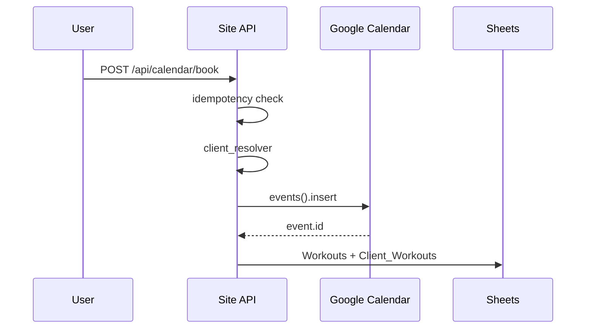

# Technical Plan: Site Booking ↔ TGbotAdmin

**Статус:** v5 — Phase 1 ✅ deployed; **Phase 2 implementation** (contract review ✅, ветка `feature/booking-phase2`)  
**Дата:** 2026-06-01 (Phase 2 amendment)  
**Таблица:** `1kyNQVjeLLe4Ra6oWuf84fHqSjUlWXI8MakVMOrCgic0`  
**Prod:** `https://mywavewake.ru`

---

## 0. Что НЕ делаем в Phase 1

- `send_telegram_notification()` в `calendar_routes.py`
- Изменение заголовков Sheets без отдельного согласования
- Изменение `SPREADSHEET_ID`, `GOOGLE_CALENDAR_ID`
- Изменение booking-flow TGbotAdmin
- Web-запись **в обход** Calendar
- Merge по телефону на стороне TGbotAdmin (отдельная future task)
- CSP/Nginx, `CHAT_BACKEND`, `competitions_ticker`, CRO-исключения Owner

---

## 1. Архитектура (подтверждено TGbotAdmin)

```
Google Calendar  →  SoT: занятость, слоты, подтверждённые события
Sheets           →  журнал после event: Clients, Workouts, Client_Workouts
Уведомления      →  только TGbotAdmin (не дублировать с Site)
```

**Контракты v1.0 (TBD закрыты):**

| Документ | Статус |
|----------|--------|
| [`BOOKING_CALENDAR_EVENT_CONTRACT_v1.md`](BOOKING_CALENDAR_EVENT_CONTRACT_v1.md) | v1.0 ✅ production |
| [`BOOKING_ROW_CONTRACT_v1.md`](BOOKING_ROW_CONTRACT_v1.md) | v1.0 ✅ |
| [`CLIENT_ID_RESOLUTION_RULE_v1.md`](CLIENT_ID_RESOLUTION_RULE_v1.md) | v1.0 ✅ |
| [`BOOKING_CALENDAR_EVENT_CONTRACT_v2.md`](BOOKING_CALENDAR_EVENT_CONTRACT_v2.md) | v2.0 ✅ approved |
| [`BOOKING_AVAILABILITY_CONTRACT_v1.md`](BOOKING_AVAILABILITY_CONTRACT_v1.md) | v1.1 ✅ approved (capacity rules) |

---

## 2. Ключевые решения Phase 1 (итог)

| Тема | Решение |
|------|---------|
| Calendar SoT | обязателен перед Sheets |
| `workout_id` | = `event.id` |
| Summary Telegram | `(ID: telegram_user_id)` — без изменений |
| Summary web | `(WEB_ID: booking_id)` — **не** `(ID: client_…)` |
| Web idempotency | Site: phone+datetime+service, booking_id, extendedProperties |
| `description` | key-value audit-only; бот не парсит |
| `location` boat | MyWave Wake + Yandex Maps URL |
| `location` gym | константа `Зал MyWave` (уточнить адрес Owner) |
| Длительность Site | gym **90 min**, boat **30 min/сет** (`booking_durations.py`) |
| TGbotAdmin сейчас | часто 60 min — joint follow-up |
| Статус в Sheets | **`подтверждено`**; internal `booked` |
| Path A / B | один `calendar_writer` + `sheets_writer` + `client_resolver` |
| Мультислот катер | API `slots[]` Phase 1; UI Phase 1.5 |
| Merge web→bot | future task TGbotAdmin |

---

## 3. Phase 1 PR — модули Site

```
app/services/booking/
  calendar_writer.py   # Calendar-first insert, summary/location/duration
  client_resolver.py   # phone normalize, find/create, anti-overwrite
  sheets_writer.py     # Workouts + Client_Workouts после event.id
  idempotency.py       # duplicate detection (optional split)
```

| # | Модуль | Ответственность |
|---|--------|-----------------|
| 1 | `calendar_writer` | insert event; return `event.id`; WEB_ID / extendedProperties |
| 2 | `client_resolver` | CLIENT_ID_RESOLUTION_RULE_v1 |
| 3 | `sheets_writer` | BOOKING_ROW_CONTRACT_v1; status `подтверждено` |
| 4 | Path A | `calendar_routes._book_slot_internal` → writers |
| 5 | Path B | `tools.py` / `sheets.book_slot` → **те же** writers |
| 6 | Idempotency | phone + date_time + service_type; booking_id |

**Логи (без PII):**

- `booking_calendar_event_created`
- `booking_row_written`
- `client_resolved`
- `booking_duplicate_detected`

---

## 4. Pipeline



---

## 5. Фазы

> Актуальная таблица Phase 2 — **§12.5**. Ниже — историческая сводка.

| Фаза | Статус |
|------|--------|
| 0 Discovery + контракты v1.0 | ✅ |
| 0.1 Dump headers Sheets на prod | ✅ |
| **1 PR writers + tests** | ✅ deployed |
| 1.5 UI мультислот катер | superseded → Phase 2 §12 |
| **2 Site booking sync** | ⏳ contracts draft |
| 2 TGbotAdmin merge by phone | future task |
| 2 Joint duration/capacity 90/30 vs bot 60m | TGbotAdmin follow-up |

---

## 6. Discovery Sheets (prod)

```bash
cd /var/www/mywave && source venv/bin/activate
export $(grep -v '^#' .env | grep -E '^SPREADSHEET_ID=' | xargs)
python3 -c "
from app import create_app
from app.services.google_sheets_service import read_records
app = create_app('production')
with app.app_context():
    sid = app.config['SPREADSHEET_ID']
    for sheet in ('Clients','Client_Workouts','Workouts','Schedule'):
        rows = read_records(sid, sheet)
        print(sheet, list(rows[0].keys()) if rows else [])
"
```

---

## 7. P0 Site (без booking) — принято

robots.txt, Metrika JS, privacy/offer, Socket.IO, Yandex Maps, Lighthouse template — ✅.

---

## 8. Definition of Done — Phase 1

1. Web-запись создаёт Calendar event.
2. `workout_id = event.id`.
3. Sheets: `Clients`, `Workouts`, `Client_Workouts` в согласованном формате.
4. Повторная web-запись на тот же слот + phone **не** создаёт дубль.
5. Path A и Path B — один writer.
6. TGbotAdmin не ломается от web-событий.
7. Telegram `(ID: tg_id)` — полная совместимость антидубля бота.
8. Web idempotency обеспечивается Site.
9. Тесты:
   - web booking
   - duplicate web booking
   - existing client by phone
   - not overwrite telegram_user_id
   - path B uses same writer
10. В логах нет PII.

---

## 9. PR checklist

- [ ] Diff трёх контрактов v1.0 приложен к PR
- [ ] Prod headers Sheets сверены (§6)
- [ ] `tests/` для booking writers
- [ ] Нет изменений §0 «что не делаем»

---

## 10. Future: TGbotAdmin merge by phone

**Задача:** `TGbotAdmin: client merge by phone`  
**Цель:** web-клиент + позже бот → один `client_id`, без дубля, без blind overwrite.

Site Phase 1 **не** блокируется этой задачей; сценарий C — known limitation.

---

## 11. Phase 1 production status (2026-06-01)

| Item | Status |
|------|--------|
| PR #11 Booking Phase 1 | ✅ deployed |
| PR #12 + #13 Public P0 | ✅ deployed |
| `test_booking_phase1.py` | 14 passed |
| `test_public_routes_p0.py` | 3 passed |
| `/robots.txt`, `/privacy`, `/offer` | 200 |
| `mywave-site` | running |
| Node / TGbotAdmin in Site release | not touched |

**Site production scope Phase 1:** ✅ **green, closed.**

---

## 12. Phase 2 — Site booking sync (NEW, not hotfix)

**Задача:** `Site Phase 2 booking sync: Зал/Катер + multi-set Катер + travel buffer`

**Статус:** ✅ contract review завершён — **implementation in progress** (`feature/booking-phase2`)

**Implementation plan:** [`BOOKING_PHASE2_IMPLEMENTATION_PLAN_v1.md`](BOOKING_PHASE2_IMPLEMENTATION_PLAN_v1.md)

### 12.1a Capacity rules (v1.1 amendment, 2026-06-01)

| | Катер | Зал |
|---|-------|-----|
| Slot duration | 30 min × N | 90 min |
| Max clients | **1** (exclusive) | **4** (group) |
| Availability model | interval conflict = block | occupancy < 4 |
| Multi-set boat | blocks full continuous range | — |

Детали: [`BOOKING_AVAILABILITY_CONTRACT_v1.md`](BOOKING_AVAILABILITY_CONTRACT_v1.md) §4.

### 12.1 Принято

| Тема | Решение |
|------|---------|
| Phase 1 | не ломаем |
| Production | не трогаем до approved rollout |
| Availability | Calendar interval (boat) + capacity (gym ≤4) |
| Катер capacity | **1 клиент / slot**, exclusive interval |
| Зал capacity | **до 4 клиентов / 90-min slot** |
| Multi-set Катер | N смежных сетов = **1 continuous Calendar event** (amendment v1 §9) |
| Зал | 90 min |
| Катер | 30 min × N |
| Travel buffer Зал↔Катер | **120 min** |
| WEB_ID | marker Site (без изменений) |
| Telegram `(ID: tg_id)` | frozen |
| Feature flags | обязательны, default **OFF** |

### 12.2 Контракты Phase 2 (deliverables)

| Документ | Статус |
|----------|--------|
| [`BOOKING_CALENDAR_EVENT_CONTRACT_v2.md`](BOOKING_CALENDAR_EVENT_CONTRACT_v2.md) | v2.0 ✅ approved |
| [`BOOKING_AVAILABILITY_CONTRACT_v1.md`](BOOKING_AVAILABILITY_CONTRACT_v1.md) | v1.1 ✅ approved (capacity rules) |
| [`BOOKING_PHASE2_STAGING_SMOKE.md`](BOOKING_PHASE2_STAGING_SMOKE.md) | ✅ approved |
| [`BOOKING_PHASE2_IMPLEMENTATION_PLAN_v1.md`](BOOKING_PHASE2_IMPLEMENTATION_PLAN_v1.md) | v1.0 |
| v1 contracts | **остаются в силе** для Phase 1 production |

### 12.3 Feature flags (default OFF)

Конфиг: `app/config/booking_features.py` (будет создан в Phase 2 PR).

| Env variable | Default | Назначение |
|--------------|---------|------------|
| `BOOKING_PHASE2_AVAILABILITY` | `0` | Calendar interval availability engine |
| `BOOKING_PHASE2_TRAVEL_BUFFER` | `0` | 2h buffer gym↔boat (требует AVAILABILITY) |
| `BOOKING_PHASE2_MULTI_SET_BOAT` | `0` | API/UI multi-set, 1 continuous event |
| `BOOKING_PHASE2_SUMMARY_V2` | `0` | Summary `Тренировка — Зал/Катер — …` |
| `BOOKING_PHASE2_GYM_LOCATION_V2` | `0` | location `Зал`, coords/map в UX |

**Production:** все flags = `0` до отдельного approved rollout.  
**Rollback:** flags → `0`, restart `mywave-site`.

### 12.4 Amendment v1 → v2 (критичное)

| v1.0 §9 | Phase 2 |
|---------|---------|
| N сетов катера → N Calendar events | N смежных сетов → **1 event**, duration N×30 |

Требует sign-off TGbotAdmin перед merge Phase 2 code.

### 12.5 Фазы (обновлено)

| Фаза | Статус |
|------|--------|
| 0 Discovery + контракты v1.0 | ✅ |
| **1 PR writers + tests** | ✅ deployed |
| 1.5 UI мультислот (v1 plan) | superseded by Phase 2 |
| **2 Site booking sync** | 🔄 implementation (`feature/booking-phase2`) |
| 2 TGbotAdmin merge by phone | future |
| 2 Joint duration/capacity bot-side | TGbotAdmin compatibility follow-up |

### 12.6 Phase 2 — planned modules (после sign-off)

```
app/config/booking_features.py      # flags
app/config/booking_venues.py        # gym coords/map (optional split)
app/services/booking/availability.py
app/services/booking/calendar_reader.py
app/services/booking/calendar_writer.py  # extend v2
app/services/booking/pipeline.py         # set_count, recheck
app/routes/calendar_routes.py
static/js/booking.js
templates/partials/booking_modals.html
tests/unit/test_booking_availability_phase2.py
tests/unit/test_booking_calendar_v2.py
```

### 12.7 Phase 2 Definition of Done (draft)

1. Contract v2 + Availability v1 signed TGbotAdmin.
2. Feature flags default OFF; Phase 1 regression green.
3. Availability: overlap + travel buffer + multi-set adjacent.
4. Calendar: 1 continuous event for N boat sets; summary v2.
5. Pre-confirm recheck before insert.
6. Staging smoke ([checklist](BOOKING_PHASE2_STAGING_SMOKE.md)) green.
7. Prod rollout by flags; only `mywave-site` restart.

### 12.8 Phase 2 — что не делать

- Hotfix поверх Phase 1 production без flags
- Изменение Telegram summary / `(ID: …)` parser contract
- Изменение `SPREADSHEET_ID`, `GOOGLE_CALENDAR_ID`, Sheets headers
- Restart `mywave-node` / `mywave-telegram-bot` без отдельного scope
- Merge web→bot by phone (still future TGbotAdmin task)

### 12.9 Следующий шаг

1. ~~TGbotAdmin review + sign-off~~ ✅ done (2026-06-01)
2. **PR1:** `feature/booking-phase2` — docs approved + `booking_features.py`
3. PR2–PR5 по [`BOOKING_PHASE2_IMPLEMENTATION_PLAN_v1.md`](BOOKING_PHASE2_IMPLEMENTATION_PLAN_v1.md)
4. Staging deploy + smoke
5. Owner-approved prod flag rollout

### 12.10 Seasonal gym schedule 2026 (Site PR)

**Период:** до `2026-09-30` включительно (авто-off с `2026-10-01`).

**Правило зала:** только понедельник и четверг, слот `19:00` (90 min).

**Server-side policy:** `app/services/booking/schedule_policy.py`  
**Env:** `BOOKING_SEASONAL_RULES_ENABLED`, `BOOKING_SEASONAL_RULES_UNTIL`, `GYM_SEASONAL_*`

**TGbotAdmin — два варианта (уточнить у владельца):**

| Вариант | Поведение |
|---------|-----------|
| **A (предпочтительный)** | Бот вызывает Site `GET /api/calendar/slots/{date}?service=gym` и `POST /api/calendar/book` — seasonal policy на сервере Site |
| **B** | Бот применяет тот же контракт локально (test vectors в `tests/unit/test_booking_schedule_policy.py`) |

**Ошибка при нарушении:** HTTP 409, `error=gym_seasonal_schedule_restricted`.

**Катер:** источник истины YCLIENTS (виджет / API). Site boat calendar booking — deprecated для новых клиентов при `YCLIENTS_ENABLED=0`.

**Deploy:** [`docs/deploy/BOOKING_SEASONAL_DEPLOY.md`](../deploy/BOOKING_SEASONAL_DEPLOY.md) — отдельный Owner GO, не смешивать с Camp STOP.

