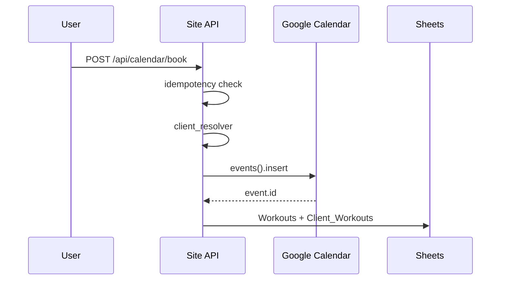

# Technical Plan: Site Booking ↔ TGbotAdmin

**Статус:** v4 — контракты v1.0 закрыты, **готовность к Phase 1 PR**  
**Дата:** 2026-05-27  
**Таблица:** `1kyNQVjeLLe4Ra6oWuf84fHqSjUlWXI8MakVMOrCgic0`  
**Prod:** `https://mywavewake.ru`

---

## 0. Что НЕ делаем в Phase 1

- `send_telegram_notification()` в `calendar_routes.py`
- Изменение заголовков Sheets без отдельного согласования
- Изменение `SPREADSHEET_ID`, `GOOGLE_CALENDAR_ID`
- Изменение booking-flow TGbotAdmin
- Web-запись **в обход** Calendar
- Merge по телефону на стороне TGbotAdmin (отдельная future task)
- CSP/Nginx, `CHAT_BACKEND`, `competitions_ticker`, CRO-исключения Owner

---

## 1. Архитектура (подтверждено TGbotAdmin)

```
Google Calendar  →  SoT: занятость, слоты, подтверждённые события
Sheets           →  журнал после event: Clients, Workouts, Client_Workouts
Уведомления      →  только TGbotAdmin (не дублировать с Site)
```

**Контракты v1.0 (TBD закрыты):**

| Документ | Статус |
|----------|--------|
| [`BOOKING_CALENDAR_EVENT_CONTRACT_v1.md`](BOOKING_CALENDAR_EVENT_CONTRACT_v1.md) | v1.0 ✅ |
| [`BOOKING_ROW_CONTRACT_v1.md`](BOOKING_ROW_CONTRACT_v1.md) | v1.0 ✅ |
| [`CLIENT_ID_RESOLUTION_RULE_v1.md`](CLIENT_ID_RESOLUTION_RULE_v1.md) | v1.0 ✅ |

---

## 2. Ключевые решения Phase 1 (итог)

| Тема | Решение |
|------|---------|
| Calendar SoT | обязателен перед Sheets |
| `workout_id` | = `event.id` |
| Summary Telegram | `(ID: telegram_user_id)` — без изменений |
| Summary web | `(WEB_ID: booking_id)` — **не** `(ID: client_…)` |
| Web idempotency | Site: phone+datetime+service, booking_id, extendedProperties |
| `description` | key-value audit-only; бот не парсит |
| `location` boat | MyWave Wake + Yandex Maps URL |
| `location` gym | константа `Зал MyWave` (уточнить адрес Owner) |
| Длительность Site | gym **90 min**, boat **30 min/сет** (`booking_durations.py`) |
| TGbotAdmin сейчас | часто 60 min — joint follow-up |
| Статус в Sheets | **`подтверждено`**; internal `booked` |
| Path A / B | один `calendar_writer` + `sheets_writer` + `client_resolver` |
| Мультислот катер | API `slots[]` Phase 1; UI Phase 1.5 |
| Merge web→bot | future task TGbotAdmin |

---

## 3. Phase 1 PR — модули Site

```
app/services/booking/
  calendar_writer.py   # Calendar-first insert, summary/location/duration
  client_resolver.py   # phone normalize, find/create, anti-overwrite
  sheets_writer.py     # Workouts + Client_Workouts после event.id
  idempotency.py       # duplicate detection (optional split)
```

| # | Модуль | Ответственность |
|---|--------|-----------------|
| 1 | `calendar_writer` | insert event; return `event.id`; WEB_ID / extendedProperties |
| 2 | `client_resolver` | CLIENT_ID_RESOLUTION_RULE_v1 |
| 3 | `sheets_writer` | BOOKING_ROW_CONTRACT_v1; status `подтверждено` |
| 4 | Path A | `calendar_routes._book_slot_internal` → writers |
| 5 | Path B | `tools.py` / `sheets.book_slot` → **те же** writers |
| 6 | Idempotency | phone + date_time + service_type; booking_id |

**Логи (без PII):**

- `booking_calendar_event_created`
- `booking_row_written`
- `client_resolved`
- `booking_duplicate_detected`

---

## 4. Pipeline



---

## 5. Фазы

| Фаза | Статус |
|------|--------|
| 0 Discovery + контракты v1.0 | ✅ |
| 0.1 Dump headers Sheets на prod | ⏳ перед merge |
| **1 PR writers + tests** | **→ следующий шаг** |
| 1.5 UI мультислот катер | backlog |
| 2 TGbotAdmin merge by phone | future task |
| 2 Joint duration/capacity 90/30 vs bot 60m | follow-up |

---

## 6. Discovery Sheets (prod)

```bash
cd /var/www/mywave && source venv/bin/activate
export $(grep -v '^#' .env | grep -E '^SPREADSHEET_ID=' | xargs)
python3 -c "
from app import create_app
from app.services.google_sheets_service import read_records
app = create_app('production')
with app.app_context():
    sid = app.config['SPREADSHEET_ID']
    for sheet in ('Clients','Client_Workouts','Workouts','Schedule'):
        rows = read_records(sid, sheet)
        print(sheet, list(rows[0].keys()) if rows else [])
"
```

---

## 7. P0 Site (без booking) — принято

robots.txt, Metrika JS, privacy/offer, Socket.IO, Yandex Maps, Lighthouse template — ✅.

---

## 8. Definition of Done — Phase 1

1. Web-запись создаёт Calendar event.
2. `workout_id = event.id`.
3. Sheets: `Clients`, `Workouts`, `Client_Workouts` в согласованном формате.
4. Повторная web-запись на тот же слот + phone **не** создаёт дубль.
5. Path A и Path B — один writer.
6. TGbotAdmin не ломается от web-событий.
7. Telegram `(ID: tg_id)` — полная совместимость антидубля бота.
8. Web idempotency обеспечивается Site.
9. Тесты:
   - web booking
   - duplicate web booking
   - existing client by phone
   - not overwrite telegram_user_id
   - path B uses same writer
10. В логах нет PII.

---

## 9. PR checklist

- [ ] Diff трёх контрактов v1.0 приложен к PR
- [ ] Prod headers Sheets сверены (§6)
- [ ] `tests/` для booking writers
- [ ] Нет изменений §0 «что не делаем»

---

## 10. Future: TGbotAdmin merge by phone

**Задача:** `TGbotAdmin: client merge by phone`  
**Цель:** web-клиент + позже бот → один `client_id`, без дубля, без blind overwrite.

Site Phase 1 **не** блокируется этой задачей; сценарий C — known limitation.
