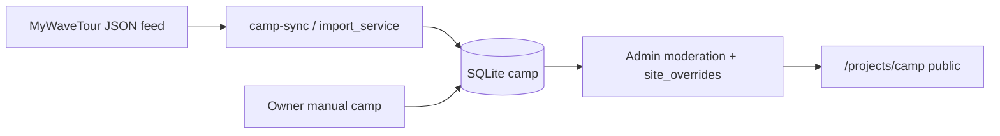

# Camp Section — технический план реализации (команда Site)

**Ветка MVP:** `feature/projects-camp-mvp`  
**Статус:** архитектура + каркас кода (feature flags OFF по умолчанию)  
**Production deploy:** не выполнять без отдельной команды владельца  

---

## 1. Резюме запроса

Спроектировать и подготовить раздел **Camp** внутри **Projects** на сайте MyWave:

- автоматическое отображение актуальных кемпов (вейксерф / вейкборд) для русскоязычной аудитории;
- два источника: **MyWaveTour** (импорт) и **собственные кемпы MyWave** (ручное добавление в админке);
- страница **не зависит** от доступности MyWaveTour в момент запроса — данные синхронизируются в локальную БД;
- импорт → нормализация → валидация → модерация → публикация.

Рекомендуемый pipeline:



---

## 2. Текущий стек и точки встраивания

| Компонент | Факт на Site_MyWave |
|-----------|---------------------|
| Backend | Python 3, **Flask**, Gunicorn/eventlet |
| ORM | **Flask-SQLAlchemy** + **Flask-Migrate** (Alembic) |
| БД prod | `instance/mywave.db` (SQLite) |
| Шаблоны | Jinja2 (`templates/`) |
| Статика | `static/` |
| Projects сейчас | **YAML showcases** (`configs/showcases/`), не ORM — `app/services/showcases.py` |
| Camp legacy | Услуга `camp` (modalCamp), проект `mywave_ruza_camp` (YAML + страница), заявки в **Google Sheets** `Project_Applications` |
| Админка | `app/routes/admin/` — эталоны: **Social**, **Online Coaching** |
| Telegram | `app/services/notifications.py` + `application_notifications.py` |
| Sitemap | `GET /sitemap.xml` в `app/__init__.py` + `templates/sitemap.xml` |
| Cron | **bash + systemd + GitHub Actions**; APScheduler/Celery **нет** |
| Blog sync pattern | `app/services/blog/sync.py` — Sheets → SQLite (эталон для Camp import) |

### Куда встроен Camp (новые файлы MVP)

```
app/config/camp_features.py
app/database/camp_models.py          # Camp, CampImportLog, CampLead
app/services/camps/
  schema.py normalize.py validate.py duplicates.py
  repository.py public.py seo.py notifications.py import_service.py
app/routes/projects/camp.py         # GET /projects/camp, /projects/camp/<slug>
app/routes/api_camps.py              # GET /api/camps, lead POST
app/routes/admin/camp.py             # /admin/camp
app/cli/camp_sync.py                 # flask camp-sync
migrations/versions/d8f1a2b3c4e5_add_camp_tables.py
templates/projects/camp/
templates/admin/camp/
tests/unit/test_camp_*.py
```

---

## 3. Есть ли уже модель Projects?

**Нет ORM-модели Project.** Проекты — это `ShowcaseConfig` из YAML (`configs/showcases/*.yaml`).

Camp — **новая сущность каталога**, отдельная от showcases:

- не ломает существующие карточки WSC / Safari / Ruza;
- Ruza Camp остаётся landing проекта; каталог `/projects/camp` агрегирует **все** кемпы, включая импорт из Tour и owner camps.

---

## 4. Есть ли админка?

**Да.** Рабочий паттерн:

- Blueprint `admin_*` + `@admin_required` + feature flags;
- список/деталь + quick actions;
- для Camp MVP: `app/routes/admin/camp.py` — список, деталь, publish/hide, ручной sync.

**Не реализовано в MVP (фаза 2):** полноценный CRUD собственных кемпов, редактор overrides в UI, загрузка изображений.

---

## 5. Telegram-уведомления

**Переиспользуем:** `app/services/notifications.py::send_telegram_notification`

**Camp lead (новый формат):** `app/services/camps/notifications.py`

```
Новая заявка на Camp
Кемп: {title}
Даты: ...
Страна: ...
Имя / Телефон / Telegram / Уровень / Комментарий
Источник: Site / Camp
```

**Env:** `NOTIFICATION_BOT_TOKEN`, `ADMIN_CHAT_ID` (см. `env.example`).

Старые лиды `camp_lead` / `ruza_lead` через `/analytics/log` **сохраняются** — не удалять до миграции UX.

---

## 6. Sitemap

- Расширен `sitemap()` и `templates/sitemap.xml`: `/projects/camp` + опубликованные slug при `CAMP_PUBLIC_ENABLED=1`.
- Canonical: `https://mywavetreaning.ru/projects/camp/{slug}` (`app/services/camps/seo.py`).

**Риск:** в `robots.txt` может быть старый домен — сверить при деплое.

---

## 7. Cron / периодический импорт

В коде нет APScheduler. Рекомендация:

```bash
# каждые 6 часов
0 */6 * * * cd /var/www/mywave && /var/www/mywave/venv/bin/flask camp-sync >> /var/log/mywave/camp-sync.log 2>&1
```

Альтернатива: GitHub Actions по аналогии с `blog-health.yml`.

---

## 8. Модель данных Camp

Реализована в `app/database/camp_models.py`:

| Группа | Поля |
|--------|------|
| Идентификация | `id`, `source_system`, `external_id`, `source_url` |
| Контент | `title`, `slug`, `short_description`, `description` |
| Классификация | `sport`, `level` |
| Гео | `country`, `region`, `city`, `location_name`, `address`, `lat`, `lng` |
| Даты | `start_date`, `end_date`, `duration_days` |
| Цена | `price_from`, `price_to`, `currency`, `price_note` |
| Программа | `included`, `not_included` |
| Организатор | `organizer_name`, `organizer_type` |
| CTA | `booking_url`, `lead_form_enabled` |
| Медиа | `cover_image_url`, `gallery`, `video_url` |
| Права | `content_rights_status` |
| Публикация | `publication_status`, `availability_status`, `priority`, `is_featured`, `is_owner_camp` |
| SEO | `seo_*`, `canonical_url`, `robots_index` |
| Sync | `source_payload`, `site_overrides`, `sync_hash`, `last_synced_at`, `duplicate_of_id` |
| Аудит | `created_at`, `updated_at`, `source_updated_at` |

**Site overrides** (ключи в `site_overrides` JSON, не затираются sync):  
`title`, SEO, `description`, обложка, `gallery`, CTA, `priority`, `is_featured`, hide/show, `robots_index`, `why_recommend`.

---

## 9. Import service

`app/services/camps/import_service.py`:

| Функция | Статус MVP |
|---------|------------|
| `fetch_tour_camps(updated_since)` | ✅ HTTP JSON feed |
| `normalize_tour_camp(raw)` | ✅ |
| `validate_camp(camp)` | ✅ |
| `detect_duplicates(camp)` | ✅ source key + fuzzy |
| `upsert_camp(camp)` | ✅ preserves `site_overrides` |
| `sync_camps_from_tour()` | ✅ + `CampImportLog` |
| `archive_expired_camps()` | ✅ `end_date < today` → `archived` |

**Контракт MyWaveTour feed.** Env: `MYWAVE_TOUR_CAMPS_FEED_URL` (default `https://api.mywavetour.ru/camps-feed.json`), `MYWAVE_TOUR_CAMPS_API_URL`, `MYWAVE_TOUR_CAMP_API_TOKEN`, `MYWAVE_TOUR_USE_API_PAGINATION`.  
Команда Tour должна предоставить: схему JSON, `external_id`, `updated_at`, права на контент, rate limits.

### Логика публикации

| Источник | Статус после импорта |
|----------|----------------------|
| MyWaveTour новый | `pending_review`, `robots_index=false` |
| Возможный дубль | `possible_duplicate` |
| Owner manual | `draft` (фаза 2 CRUD) |
| После модерации | `published` вручную в админке |

### Дедупликация

1. Primary: `source_system + external_id` (unique constraint).
2. Fuzzy: `normalized_title + country + start_date + organizer_name + sport`.

---

## 10. Публичные маршруты

| Маршрут | Файл | MVP |
|---------|------|-----|
| `GET /projects/camp` | `app/routes/projects/camp.py` | ✅ |
| `GET /projects/camp/<slug>` | там же | ✅ |
| `GET /api/camps` | `app/routes/api_camps.py` | ✅ |
| `GET /api/camps/<slug>` | там же | ✅ |
| `POST /api/camps/<id>/lead` | там же | ✅ |

Feature flags: `CAMP_MODULE_ENABLED`, `CAMP_PUBLIC_ENABLED` (оба `1`).

---

## 11. UX (фаза 2 после наполнения данными)

MVP-шаблоны: фильтры, бейджи (`MyWave Camp` / `Партнёрский` / `Из MyWaveTour`), trust block, CTA, архивное сообщение, похожие кемпы.

Связь с карточкой услуги Camp на главной: кнопка «Все Вейксерф лагеря» → `https://www.mywavetour.ru/?discipline=вейксерф` (уже сделано); после запуска каталога — заменить на `/projects/camp?sport=wakesurf`.

---

## 12. SEO

`app/services/camps/seo.py`: title, description, H1, canonical, JSON-LD `Event` + `Place` + `Organization` + `Offer`.

Индексируются только `published` + `robots_index=true`.  
Draft / hidden / duplicate / cancelled — `noindex`.

---

## 13. Оценка сроков MVP → Production

| Фаза | Объём | Срок (1 dev) |
|------|-------|--------------|
| **MVP (ветка)** | модель, import, admin list, public list/detail, API, tests | **3–5 дней** (каркас готов) |
| **Phase 2** | admin CRUD owner camps, override editor, images, CSS polish | 5–7 дней |
| **Phase 3** | Tour feed contract, staging sync, модерация workflow, дедуп UI | 3–5 дней |
| **Phase 4** | sitemap/SEO QA, lead form JS, интеграция с Projects hub, деплой | 2–3 дня |

**Итого до production-ready:** ~3–4 недели с учётом согласования API MyWaveTour.

---

## 14. Планируемые изменения файлов (полный rollout)

### Уже в MVP-ветке

См. список в §2.

### Фаза 2–4 (дополнительно)

| Файл | Изменение |
|------|-----------|
| `templates/projects.html` | CTA «Все кемпы» → `/projects/camp` |
| `templates/index.html` | ссылка в секции Projects |
| `static/css/camp.css` | стили каталога |
| `static/js/camp-lead-form.js` | POST `/api/camps/<id>/lead` |
| `app/routes/admin/camp.py` | CRUD, override form |
| `deploy/cron/camp-sync.cron` | пример cron |
| `docs/deploy/CAMP_DEPLOY.md` | runbook |
| `.github/workflows/camp-sync.yml` | опционально |

---

## 15. Риски до начала разработки

| Риск | Митигация |
|------|-----------|
| **Нет контракта API MyWaveTour** | Зафиксировать JSON schema с командой Tour; stub URL в env |
| **Дубли Ruza Camp vs Tour** | Ruza остаётся showcase; в каталоге — `is_owner_camp` + модерация |
| **Права на контент из Tour** | `content_rights_status`, не публиковать `restricted` |
| **Два потока лидов** (modalCamp vs catalog) | Единый Telegram-формат; позже — merge в Sheets |
| **SQLite на prod** | Для каталога достаточно; при росте — PostgreSQL migration |
| **Cron не настроен** | Импорт только вручную до настройки cron |
| **Feature flag забыли включить** | Чеклист деплоя + smoke test |
| **Домен в sitemap/robots** | Привести к `mywavetreaning.ru` |

---

## 16. Команды для сервера (точные)

> Выполнять на **staging** сначала. Production — только после approve владельца.

### 16.1 Подготовка ветки на сервере

```bash
cd /var/www/mywave
sudo -u www-data git fetch origin
sudo -u www-data git checkout feature/projects-camp-mvp
sudo -u www-data git pull origin feature/projects-camp-mvp
```

### 16.2 Env (добавить в `.env`, не коммитить)

```bash
sudo -u www-data bash -c 'cat >> /var/www/mywave/.env << EOF

# Camp catalog (staging: start with flags OFF, then enable step by step)
CAMP_MODULE_ENABLED=1
CAMP_ADMIN_ENABLED=1
CAMP_PUBLIC_ENABLED=0
CAMP_IMPORT_ENABLED=1
MYWAVE_TOUR_CAMPS_FEED_URL=https://api.mywavetour.ru/camps-feed.json
MYWAVE_TOUR_CAMPS_API_URL=https://api.mywavetour.ru/camps
MYWAVE_TOUR_CAMP_API_TOKEN=
MYWAVE_TOUR_USE_API_PAGINATION=0
EOF'
```

### 16.3 Миграция БД

```bash
cd /var/www/mywave
source venv/bin/activate
export FLASK_APP=main:app
flask db upgrade
```

### 16.4 Первый импорт (ручной)

```bash
cd /var/www/mywave
source venv/bin/activate
export FLASK_APP=main:app
flask camp-sync
```

### 16.5 Проверка админки

```bash
curl -s -o /dev/null -w "%{http_code}\n" https://mywavetreaning.ru/admin/camp/
# Ожидание: 302 (login) или 200 если авторизованы
```

### 16.6 Включение публичного раздела (после модерации)

```bash
sudo -u www-data sed -i 's/CAMP_PUBLIC_ENABLED=0/CAMP_PUBLIC_ENABLED=1/' /var/www/mywave/.env
sudo systemctl restart mywave
```

### 16.7 Cron импорта (каждые 6 часов)

```bash
sudo tee /etc/cron.d/mywave-camp-sync << 'EOF'
0 */6 * * * www-data cd /var/www/mywave && /var/www/mywave/venv/bin/flask camp-sync >> /var/log/mywave/camp-sync.log 2>&1
EOF
sudo mkdir -p /var/log/mywave
sudo chown www-data:www-data /var/log/mywave
```

### 16.8 Smoke tests

```bash
cd /var/www/mywave
source venv/bin/activate
pytest tests/unit/test_camp_import.py tests/unit/test_camp_public_api.py -q

curl -s https://mywavetreaning.ru/api/camps | head -c 500
curl -s -o /dev/null -w "%{http_code}\n" https://mywavetreaning.ru/projects/camp
curl -s https://mywavetreaning.ru/sitemap.xml | grep -c projects/camp
```

### 16.9 Restart приложения

```bash
sudo systemctl restart mywave
sudo systemctl status mywave --no-pager
```

### 16.10 Rollback

```bash
cd /var/www/mywave
sudo -u www-data git checkout main
# в .env: CAMP_MODULE_ENABLED=0
flask db downgrade d8f1a2b3c4e5   # только если таблицы пустые и approve владельца
sudo systemctl restart mywave
```

---

## 17. Критерий готовности MVP

- [ ] Миграция `d8f1a2b3c4e5` применена на staging
- [ ] `flask camp-sync` успешно пишет в `camp` + `camp_import_log`
- [ ] Импортированные кемпы в `pending_review`, не на публичной витрине
- [ ] Админ публикует кемп → виден на `/projects/camp` при `CAMP_PUBLIC_ENABLED=1`
- [ ] Lead → Telegram + запись в `camp_lead`
- [ ] Sitemap содержит опубликованные slug
- [ ] Unit-тесты camp green в CI
- [ ] Production deploy — отдельная команда владельца

---

## 18. Связь с предыдущей задачей (кнопка MyWaveTour)

В карточке услуги **Camp** добавлена ссылка «Все Вейксерф лагеря» на `mywavetour.ru/?discipline=вейксерф`.  
После запуска каталога Site рекомендуется заменить на внутренний URL `/projects/camp?sport=wakesurf` для SEO и независимости от Tour uptime.

---

*Документ подготовлен командой Site (AI Agents). Ветка: `feature/projects-camp-mvp`.*
