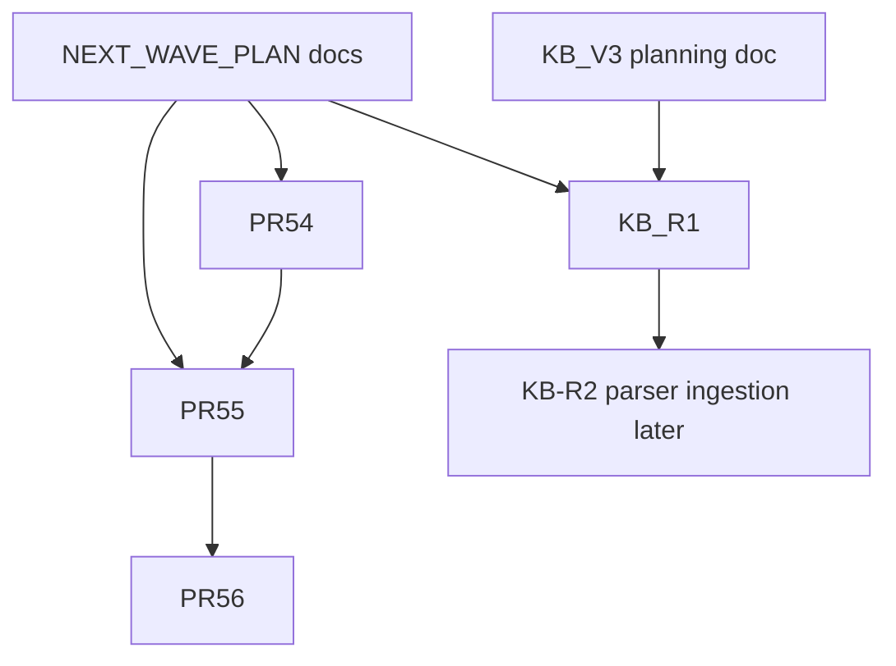

# NEXT WAVE IMPLEMENTATION PLAN

**MyWave Site — Wake Challenge + Social 2.0 + Social booking + KB runtime**

| Field | Value |
|-------|-------|
| **Status** | planning only |
| **Production baseline** | `f5017eec` (PR53.4.1 deployed, Owner QA PASS) |
| **Closed wave** | PR51–PR57 + follow-up PR53.1 → PR53.4.1 |
| **Runtime changes in this PR** | **NO** |
| **Deploy needed** | **NO** |
| **Related planning** | [KB v3 World Knowledge Base Plan](../kb/KB_V3_WORLD_KNOWLEDGE_BASE_PLAN.md) |

---

## 1. Executive summary

Следующая волна — **четыре независимых трека** с жёсткими Owner approval gates:

1. **Roadmap PR54** — Wake Challenge consents + unified project notifications  
2. **Roadmap PR55** — Social 2.0 MVP (public page, form, storage, notify)  
3. **Roadmap PR56** — Social booking integration (только после PR55)  
4. **KB runtime MVP** — intent fix + первые methodology cards (после KB v3 docs, параллельно с PR54/55 по контенту)

**Принцип:** один runtime PR = один scope. Не смешивать consents, Social, booking core, KB ingestion и `.env` в одном merge.

**Рекомендуемый первый runtime PR после approval этого плана:** **PR54** (низкий риск для booking, переиспользует `application_notifications.py` из PR53).

---

## 2. Current production baseline

| Item | State |
|------|-------|
| HEAD | `f5017eec` |
| Competitions ticker mobile | CSS transform autoplay, `?v=8` |
| Product storefront | PR53.3 deployed |
| Footer | «Социальная ответственность» link |
| Telegram product leads | `notify_new_application('product')`, status `new` |
| Social module | Feature flags default OFF (`app/config/social_features.py`) |
| Unified notifications | `app/services/application_notifications.py` (PR53 foundation) |
| KB v3 planning | `docs/kb/KB_V3_WORLD_KNOWLEDGE_BASE_PLAN.md` merged (docs only) |
| Booking capacity / calendar | **unchanged** — out of scope |

---

## 3. Remaining roadmap PRs (ordered)

```text
1. PR54  — Wake Challenge consents + project notifications
2. PR55  — Social 2.0 MVP
3. PR56  — Social booking integration
4. KB-R1 — KB runtime MVP (intent + first methodology cards)
5. KB-R2 — (later) world source ingestion / parser-to-KB pipeline
```

---

## 4. Scope / out-of-scope per PR

### PR54 — Wake Challenge consents + project notifications

**In scope:**
- После анкеты тренера Wake Challenge — малозаметная ссылка «согласия» → текстовые документы (обработка ПДн, медиа, тренировки — отдельные документы по решению Legal Agent)
- Telegram через **единый** `notify_new_application()` для:
  - `wake_challenge`
  - `wakesurf_safari`
  - `ruza_camp` / `camp`
  - `coach_on_location`
  - `consulting`
  - `social`
  - `generic_project`
- Сохранение заявок **до** notify; Telegram failure не ломает primary flow
- Sanitized logs (`application_notify_result`, без секретов/MagicMock)
- Подключение существующих project/modal forms к единому storage contract (Sheets или log fallback — как в PR53 product leads)

**Out of scope:**
- Booking capacity, calendar slots, TGbotAdmin
- Сбор паспортов, диагнозов, мед. документов
- Social 2.0 page redesign (PR55)
- `.env` / production secrets в PR

---

### PR55 — Social 2.0 MVP

**In scope:**
- `/social` v2: понятный public copy программы
- Форма заявки (поля из `SOCIAL_APPLICATIONS_HEADERS` — без запрещённых ключей из `social_schema.py`)
- Статусы: `new` → `review` → `approved` / `rejected` (без `scheduled` до PR56)
- Append в `Social_Applications` (Admin sheet, см. `docs/integration/SHEETS_ID_CANON.md`)
- `notify_new_application('social', ...)` — без чувствительных деталей в Telegram (без `health_notes` целиком)
- Public stats / counters — только если `SOCIAL_PUBLIC_STATS_ENABLED` и данные агрегированы
- Feature flags: `SOCIAL_MODULE_ENABLED`, `SOCIAL_WIDGET_ENABLED`, `SOCIAL_APPLICATIONS_ENABLED` — по Owner matrix

**Out of scope:**
- Автозапись в календарь
- `Social_Sessions` writes (PR56)
- Изменение boat/gym booking
- TGbotAdmin

---

### PR56 — Social booking integration

**Prerequisite:** PR55 merged + Owner QA PASS + explicit **PR56 ACCEPTED FOR RUNTIME**

**In scope:**
- Связь `application_id` → `Social_Sessions` (schema уже в `social_schema.py`)
- Статусы: `scheduled`, `completed`, `cancelled`
- Ручное назначение слота админом/тренером (не автобукинг)
- Audit log в `Social_Audit_Log`
- Опциональная ссылка `booking_id` / `calendar_event_id` без изменения boat/gym pipelines

**Out of scope:**
- Capacity rules change
- Автоматическая запись без подтверждения
- Изменение `get_available_slots` / boat multi-slot logic

---

### KB-R1 — KB runtime MVP

**Prerequisite:** KB v3 planning merged; Owner approval **KB-R1 ACCEPTED FOR RUNTIME**

**In scope (см. [KB_V3_WORLD_KNOWLEDGE_BASE_PLAN.md](../kb/KB_V3_WORLD_KNOWLEDGE_BASE_PLAN.md)):**
- Intent fix: `gym_why` vs `gym_what_to_bring` vs `gym_booking` vs `gym_price`
- `knowledge_base/chat/_meta/intents.yaml` + `gym/why_train.md`
- Первые methodology/public cards:
  - gym why / gym for wakesurf / gym for wakeboard
  - boat training (high-level)
  - competition preparation (intro)
  - trick learning approach (intro)
- Golden tests для Owner QA questions
- Review workflow: `review_status: draft|approved` gate для chat snippets

**Out of scope:**
- Parser-to-KB ingestion runtime (KB-R2)
- Массовый импорт YouTube/RSS
- Chat model / OpenAI prompt overhaul

---

## 5. Dependency map



### Sequential (must wait)

| Step | Blocked by |
|------|------------|
| PR56 | PR55 merged + Owner PR56 approval |
| KB-R2 | KB-R1 + Owner ingestion approval |
| Social calendar writes | PR56 only |

### Parallel (safe with separate PRs)

| Workstream | Can run in parallel with |
|------------|--------------------------|
| Legal/consent texts (PR54) | Social copy draft (PR55), KB card authoring (KB-R1) |
| Sheets schema review | KB markdown authoring |
| Notification message templates | Frontend mockups |
| PR54 runtime | KB-R1 runtime (different code paths) — **only after separate Owner approvals** |

### Never parallel without Owner approval

- Booking core / capacity changes
- Social → calendar integration (PR56 before PR55 done)
- TGbotAdmin changes
- Production `.env` edits
- Parser-to-KB runtime ingestion
- Migrations

---

## 6. AI Agents / subagents roles

| Agent | Responsibility |
|-------|----------------|
| **General Manager** | Roadmap, scope boundaries, Owner approval checklist, deploy gates, no PR scope mixing |
| **Product Owner / UX** | User scenarios, mobile UX, acceptance criteria, CTA/form copy |
| **Legal / Consent** | Consent texts; separate PDn vs media; minimal data collection |
| **Frontend** | Forms, mobile layout, footer/links, validation, screenshots/video |
| **Backend Flask** | Routes, handlers, validation, storage, status transitions, API contracts |
| **Google Sheets / Calendar** | Sheet schemas, append/idempotency; Calendar **only PR56+** |
| **Telegram Notifications** | `notify_new_application`, types, sanitized logs, graceful fallback, no MagicMock in messages |
| **QA / E2E** | Unit/e2e, mobile evidence, smoke, regression checklist |
| **SEO / Content / KB** | Social/Wake copy, KB cards, intent map, `blog_ready` / `internal_only` |
| **DevOps / Release** | Deploy/rollback notes, health/smoke commands; deploy NOT STARTED until Owner says |
| **Security / Privacy** | No secrets in PR; no sensitive Telegram content; `env.example` only for new var names |

---

## 7. Data schemas (draft)

### 7.1 Wake Challenge / project applications (PR54)

**Sheet tab (proposal):** `Project_Applications` on Admin sheet (`SPREADSHEET_ID`)

| Column | Type | Notes |
|--------|------|-------|
| `application_id` | string | UUID |
| `created_at` | ISO8601 | |
| `updated_at` | ISO8601 | |
| `status` | enum | `new`, `review`, `closed` |
| `application_type` | enum | `wake_challenge`, `wakesurf_safari`, `ruza_camp`, `camp`, `coach_on_location`, `consulting`, `generic_project` |
| `name` | string | |
| `phone` | string | |
| `telegram` | string | optional |
| `email` | string | optional |
| `comment` | string | max 500 |
| `page_url` | string | |
| `source` | string | |
| `consent_version` | string | PR54 |
| `consent_personal_data` | bool | |
| `consent_media` | bool | optional per form |
| `ip_hash` | string | hashed, not raw IP in Telegram |

**Telegram payload (sanitized):** name, phone, type, comment excerpt (≤200 chars), page_url, status `new` — **no** health/passport fields.

---

### 7.2 Social applications (PR55)

**Existing contract:** `SOCIAL_APPLICATIONS_HEADERS` in `app/services/social_schema.py`

Key rules:
- `FORBIDDEN_APPLICATION_KEYS` enforced at API
- `health_notes` — store in sheet, **truncate/summarize** in Telegram
- Status PR55: `new`, `review`, `approved`, `rejected`, `closed`

---

### 7.3 Social sessions (PR56)

**Existing contract:** `SOCIAL_SESSIONS_HEADERS`

| Status | Meaning |
|--------|---------|
| `scheduled` | Admin assigned slot |
| `completed` | Session done |
| `cancelled` | Cancelled |

No auto-write from public form in PR55.

---

### 7.4 Notification logs (all PRs)

**Log events (structured, no PII dumps):**

| Event | Fields |
|-------|--------|
| `application_notify_result` | `application_type`, `telegram_ok`, `telegram_status` |
| `application_notify_skipped` | `reason`, `application_type` |
| `application_notify_failed` | `application_type`, `error` (truncated) |

**Never log:** bot token, chat_id, full phone in debug, MagicMock repr, raw `health_notes`.

---

### 7.5 KB source card (KB-R2, draft only)

See [KB_V3_WORLD_KNOWLEDGE_BASE_PLAN.md §6](../kb/KB_V3_WORLD_KNOWLEDGE_BASE_PLAN.md). Not implemented in PR54–56.

---

### 7.6 KB methodology card (KB-R1)

| Field | Example |
|-------|---------|
| `id` | `gym_why_train` |
| `discipline` | `gym_training` |
| `intent_id` | `gym_why` |
| `short_answer` | 2–4 sentences |
| `review_status` | `draft` → `approved` |
| `use_for_chat` | `yes` after approve |

---

## 8. Acceptance criteria by PR

### PR54

- [ ] Consent link visible on Wake Challenge trainer form (unobtrusive)
- [ ] Consent documents open/readable (static or legal templates)
- [ ] All listed project types trigger `notify_new_application` with correct `application_type`
- [ ] Lead saved if Telegram fails
- [ ] No MagicMock/object repr in Telegram text
- [ ] No extra sensitive fields collected
- [ ] Desktop/mobile forms OK; booking unchanged
- [ ] Tests + CI PASS
- [ ] Deploy NOT STARTED until Owner approval

### PR55

- [ ] `/social` public copy clear on mobile
- [ ] Form submits → row in `Social_Applications`
- [ ] Status `new` on create
- [ ] Telegram notification without sensitive details
- [ ] Feature flags documented; default OFF until Owner enables on staging
- [ ] **No** calendar auto-booking
- [ ] Tests + CI PASS

### PR56

- [ ] Admin workflow assigns session manually
- [ ] `Social_Sessions` row created with `scheduled`
- [ ] Status transitions logged in `Social_Audit_Log`
- [ ] Boat/gym booking regression PASS
- [ ] Capacity unchanged
- [ ] Owner QA on staging before prod

### KB-R1

- [ ] «Для чего мне зал?» → gym why (not what_to_bring)
- [ ] Golden tests PASS for 4 gym intents
- [ ] 6 first methodology cards exist with `review_status: approved`
- [ ] No parser ingestion in this PR
- [ ] Chat runtime diff isolated; rollback = revert MD + routing

---

## 9. Test plan by PR

| PR | Unit | E2E / visual | Smoke after deploy |
|----|------|--------------|-------------------|
| PR54 | notification formatter, storage append, consent link in template | project form submit, Telegram mock | `/health/*`, one project form POST |
| PR55 | `social_schema` validation, feature flags | `/social` mobile form 390px | `/social` 200, apply API 201 |
| PR56 | session status transitions | admin assign flow (staging) | booking smoke unchanged |
| KB-R1 | `routing.py` intent order, golden questions | chat API sample questions | chat smoke, no regression on booking CTA |

---

## 10. Deploy plan by PR

| PR | Restart required | Cache bust | Owner gate |
|----|------------------|------------|------------|
| PR54 | `systemctl restart mywave-site` | static if JS/CSS | `PR54 ACCEPTED FOR MERGE` → deploy block |
| PR55 | restart + verify flags on server | `social-mission.css`, form JS | `PR55 ACCEPTED FOR MERGE` |
| PR56 | restart | — | `PR56 ACCEPTED FOR MERGE` (after PR55 prod QA) |
| KB-R1 | restart (routing) | — | `KB-R1 ACCEPTED FOR MERGE` |

**Standard deploy block (Owner executes):**

```bash
sudo MYWAVE_ROOT=/var/www/mywave bash /var/www/mywave/deploy/scripts/backup_mywave.sh
cd /var/www/mywave && git pull --ff-only origin main
git rev-parse --short HEAD
sudo systemctl restart mywave-site
curl -sS https://mywavewake.ru/health/ready
# PR-specific smoke...
```

Site team **does not** deploy without explicit Owner instruction.

---

## 11. Rollback considerations

| PR | Rollback |
|----|----------|
| PR54 | `git revert` merge commit; forms fall back to pre-notify behavior; Sheets rows retained |
| PR55 | Disable `SOCIAL_*` flags in `.env` (Owner); revert templates/routes |
| PR56 | Disable session creation endpoint; revert without deleting Sheets history |
| KB-R1 | Revert routing + MD files; chat falls back to KB v2 behavior |

Backup before each prod deploy: `/var/backups/mywave/YYYYMMDD-HHMM`.

---

## 12. Risks and open questions for Owner

### Risks

| Risk | Mitigation |
|------|------------|
| Scope creep PR54+55 in one merge | Strict one-PR-one-scope rule |
| Sensitive data in Telegram | Schema forbid list + message formatter review |
| Social flags ON too early | Staging QA before prod `.env` (Owner only) |
| PR56 breaks booking | No calendar writes in PR55; isolated service layer |
| KB intent regression | Golden tests before merge |
| Sheets tab missing on prod | Pre-deploy checklist (`Social_Applications_tab YES`) |

### Open questions for Owner

1. **PR54 consents:** отдельные страницы `/legal/...` или modal PDF? Нужны финальные тексты от Legal Agent.
2. **PR54 storage:** новый tab `Project_Applications` или расширить существующие project-specific tabs?
3. **PR55 flags:** какие `SOCIAL_*` включаем на staging первыми? (`MODULE` only vs full MVP)
4. **PR55 Telegram:** показывать ли `child_age` / `city` в уведомлении или только «новая social заявка» + ссылка на sheet?
5. **PR56:** кто назначает слот — только Owner вручную в Sheets или нужен admin UI (out of scope для MVP)?
6. **KB-R1:** приоритет карточек — только gym intents сначала или все 6 параллельно?
7. **KB-R1 vs PR54/55:** разрешить параллельный runtime merge или строго sequential?

---

## 13. Recommended first runtime PR

**PR54 — Wake Challenge consents + project notifications**

**Why first:**
- Reuses proven `application_notifications.py` (PR53/53.4)
- No booking/calendar risk
- Unblocks Owner visibility for all project leads
- Social 2.0 (PR55) can follow immediately after PR54 QA

**Owner approval phrase to start runtime:**

```text
PR54 ACCEPTED FOR RUNTIME — begin implementation branch
```

---

*Document: Site Team · Next wave planning · Runtime: NO · Deploy: NOT NEEDED*
